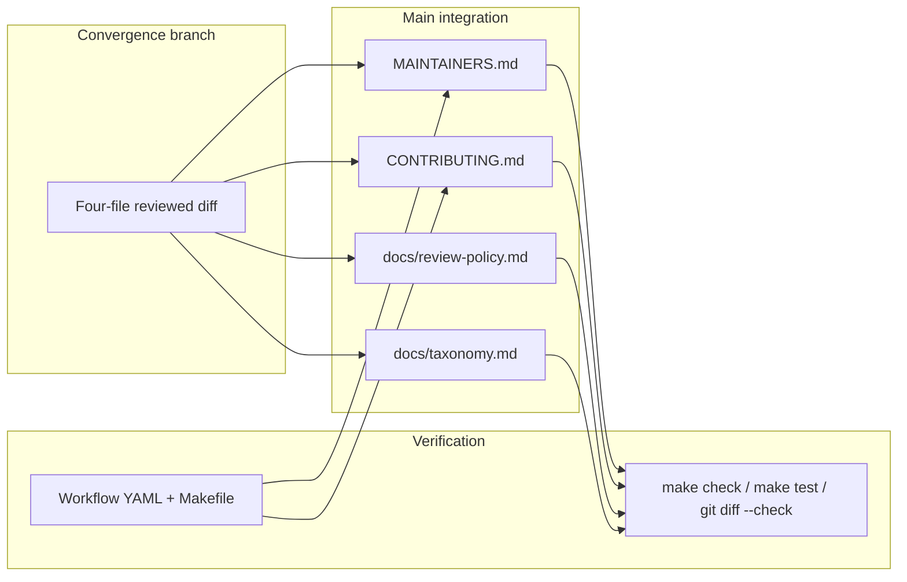

# PRD: Phase 8/9 Maintainer Operations Integration Repair

## Introduction

Integrate the already-reviewed governance documentation from `origin/phase-8-9-maintainer-ops-convergence` onto `main` for four files only: `MAINTAINERS.md`, `CONTRIBUTING.md`, `docs/review-policy.md`, and `docs/taxonomy.md`. This is an **integration repair**, not new governance authoring — the convergence branch diff is clean and limited to documentation drift between implemented Phase 4/5 automation and maintainer-facing policy prose.

**Intent:** After Phase 4 README checks and Phase 5 GitHub workflows landed on `main`, maintainer docs still describe a pre-automation world (for example, “no required CI gate” and “no scheduled link checker”). Contributors and maintainers need one truthful, cross-linked governance story about what automation runs, what local commands reproduce it, and what human judgment remains.

## Context

### Customer ask

Integrate the completed branch diff from `origin/phase-8-9-maintainer-ops-convergence` onto `main` for only `MAINTAINERS.md`, `CONTRIBUTING.md`, `docs/review-policy.md`, and `docs/taxonomy.md`. Ensure `MAINTAINERS.md` truthfully reflects implemented automation and maintainer-owned weekly, monthly, and quarterly stewardship without inventing staffing, SLAs, or automation the repository does not have. Keep all four documents consistent about CI, link checks, awesome-lint, scheduled maintenance, local equivalents, and maintainer judgment boundaries. Do not add or remove README resource entries. Do not edit planner-owned `docs/internal/*` files. Leave `make check`, `make test`, and `git diff --check` passing.

### Problem

Governance documentation on `main` is stale relative to implemented repository automation:

- `MAINTAINERS.md` still states there is no scheduled link checker, no CI gate, and no awesome-lint enforcement, contradicting `.github/workflows/ci.yml`, `link-check.yml`, `awesome-lint.yml`, and `scheduled-maintenance.yml`.
- `CONTRIBUTING.md` omits the CI workflow from its GitHub Actions table and understates what automated checks cover before maintainer review.
- `docs/review-policy.md` and `docs/taxonomy.md` cross-reference tables do not point maintainers to the converged automation summary and maintenance cadence in `MAINTAINERS.md`.

This drift confuses contributors reproducing CI locally, maintainers triaging workflow failures, and reviewers applying merge policy.

### Solution

Cherry-pick or apply the reviewed four-file diff from `origin/phase-8-9-maintainer-ops-convergence` onto the integration branch. Verify every automation claim against existing workflow YAML and `Makefile` targets. Confirm cross-document consistency for workflow names, triggers, local equivalents, and maintainer-judgment boundaries. Run repository quality gates. Do not broaden scope beyond these four files.

## Goals

- Land the reviewed convergence documentation onto `main` without re-authoring governance prose.
- Make `MAINTAINERS.md` the canonical, truthful description of implemented automation and optional human stewardship cadence (weekly link triage, monthly scheduled maintenance review, quarterly governance spot-check).
- Align `CONTRIBUTING.md`, `docs/review-policy.md`, and `docs/taxonomy.md` with the same CI, link-check, awesome-lint, and scheduled-maintenance facts.
- Preserve explicit boundaries: automation does not replace maintainer scope, canonical-link, quality, or merge decisions; no SLAs, staffing levels, or auto-merge are claimed.

## Project-level acceptance criteria

- [ ] Only `MAINTAINERS.md`, `CONTRIBUTING.md`, `docs/review-policy.md`, and `docs/taxonomy.md` differ from `main` for governance content (plus this batch’s planning artifacts under `tasks/todo/`).
- [ ] `MAINTAINERS.md` documents CI, Link Check, Awesome Lint, and Scheduled Maintenance with triggers and local equivalents that match `.github/workflows/*.yml` and `Makefile` targets.
- [ ] `MAINTAINERS.md` describes weekly, monthly, and quarterly maintainer stewardship as availability-based human tasks tied to existing workflow schedules, without inventing dedicated staff, 24/7 coverage, or response-time SLAs.
- [ ] `CONTRIBUTING.md`, `docs/review-policy.md`, and `docs/taxonomy.md` agree with `MAINTAINERS.md` on automation scope, local reproduction commands, and maintainer judgment boundaries.
- [ ] No README resource entries are added or removed; no `docs/internal/*` files are edited.
- [ ] Quality gate: `make check`, `make test`, and `git diff --check` all pass from the repository root.

## User Stories

### US-001: Integrate MAINTAINERS.md automation and cadence documentation

**Description:** As a maintainer, I want `MAINTAINERS.md` to describe implemented automation and recurring stewardship so I can triage workflow failures and set contributor expectations without referencing obsolete pre-Phase-5 prose.

**Acceptance Criteria:**

- [ ] Apply the reviewed `MAINTAINERS.md` changes from `origin/phase-8-9-maintainer-ops-convergence` (intro, **Automated checks**, **Maintainer maintenance cadence**, merge policy, and **What maintainers do not do today** sections).
- [ ] The **Automated checks** table lists CI, Link Check, Awesome Lint, and Scheduled Maintenance with triggers and local equivalents matching `.github/workflows/ci.yml`, `link-check.yml`, `awesome-lint.yml`, and `scheduled-maintenance.yml`.
- [ ] Weekly, monthly, and quarterly cadence sections describe human tasks “when maintainers have availability” and explicitly deny dedicated staff, 24/7 coverage, and response-time SLAs.
- [ ] Merge policy states resource PRs should have passing automated checks before merge while preserving manual scope and quality review.
- [ ] No claims of auto-merge, dedicated moderation staff, or automation the repository does not implement.
- [ ] Typecheck passes

### US-002: Integrate CONTRIBUTING.md GitHub Actions and review guidance

**Description:** As a contributor, I want `CONTRIBUTING.md` to list all CI workflows and explain the split between automated checks and maintainer review so I can reproduce failures locally before opening a pull request.

**Acceptance Criteria:**

- [ ] Apply the reviewed `CONTRIBUTING.md` changes from `origin/phase-8-9-maintainer-ops-convergence` (GitHub Actions table, CI workflow row, schedule wording, and pre-merge review paragraph).
- [ ] GitHub Actions table includes CI with local equivalents `make test` and `make check`, Link Check (PRs + weekly Mondays), Awesome Lint, and Scheduled Maintenance (monthly 1st).
- [ ] Prose states CI runs Go format checks, `go test ./...`, and README validation via `make check` / `internal/checks`.
- [ ] Closing paragraph distinguishes automated README/Go/link/awesome-list checks from manual maintainer scope, canonical-link, and quality review; links to `MAINTAINERS.md`.
- [ ] Typecheck passes

### US-003: Align review-policy and taxonomy cross-references

**Description:** As a reviewer, I want `docs/review-policy.md` and `docs/taxonomy.md` to point to the converged maintainer automation and cadence documentation so governance docs stay mutually consistent.

**Acceptance Criteria:**

- [ ] Apply the reviewed `docs/review-policy.md` change: the governance-documents table row for `MAINTAINERS.md` references automated checks summary and maintainer maintenance cadence.
- [ ] Apply the reviewed `docs/taxonomy.md` changes: governance-documents table rows reference local checks, automated enforcement, and `MAINTAINERS.md` merge policy and cadence; the Phase 4/5 automation paragraph links to `MAINTAINERS.md#automated-checks`.
- [ ] Cross-reference wording does not contradict `MAINTAINERS.md` or `CONTRIBUTING.md` on workflow names, triggers, or local equivalents.
- [ ] Typecheck passes

### US-004: Verify governance consistency and repository quality gates

**Description:** As a maintainer merging this integration repair, I want end-to-end verification that the four governance files are consistent, scope-limited, and pass repository checks.

**Acceptance Criteria:**

- [ ] Diff against `main` is limited to the four governance files and this batch’s `tasks/todo/` planning artifacts — no README edits, no `docs/internal/*` edits, no workflow or Go source changes unless required to fix a factual doc error discovered during verification.
- [ ] Manual read confirms all four files agree on: CI (`make test`, `make check`), Link Check (`make links`, weekly Mondays), Awesome Lint (`npx awesome-lint`), Scheduled Maintenance (monthly 1st, `make check` + `make links`), and maintainer judgment boundaries automation cannot replace.
- [ ] `make check` exits 0 from repository root.
- [ ] `make test` exits 0 from repository root.
- [ ] `git diff --check` reports no whitespace errors on changed files.
- [ ] Typecheck passes
- [ ] Tests pass

## Functional Requirements

- FR-1: Integrate the reviewed four-file diff from `origin/phase-8-9-maintainer-ops-convergence` without expanding scope.
- FR-2: Document CI workflow with PR/push-to-`main` triggers and local equivalents `make test` and `make check`.
- FR-3: Document Link Check with PR and weekly Monday schedule and local equivalent `make links`.
- FR-4: Document Awesome Lint with PR/push-to-`main` triggers and local equivalent `npx awesome-lint`.
- FR-5: Document Scheduled Maintenance with monthly 1st schedule and local equivalents `make check` and `make links`.
- FR-6: Document weekly (link triage), monthly (scheduled maintenance + stale-PR spot-check), and quarterly (optional governance spot-check) maintainer cadences as availability-based human stewardship.
- FR-7: State explicitly that maintainers retain scope, canonical-link, quality, merge, and removal judgments automation cannot make.
- FR-8: Update cross-reference tables in `docs/review-policy.md` and `docs/taxonomy.md` to point at converged maintainer documentation.

## Non-Goals

- No new governance authoring beyond integrating the reviewed convergence diff.
- No README resource entry additions, removals, or rewording.
- No edits to planner-owned `docs/internal/*` files.
- No changes to GitHub workflow YAML, Go checks, or Makefile targets unless a factual mismatch is discovered and must be corrected to keep docs truthful.
- No claims of auto-merge bots, dedicated moderation staff, fixed-hour coverage, or response-time SLAs.
- No Phase 7 category deepening or Phase 10 launch-readiness work in this batch.

## High-level technical design

This batch is documentation-only integration:

1. **Source of truth for automation facts:** `.github/workflows/ci.yml`, `link-check.yml`, `awesome-lint.yml`, `scheduled-maintenance.yml`, root `Makefile`, and `.lychee.toml`.
2. **Source of truth for governance prose:** reviewed diff on `origin/phase-8-9-maintainer-ops-convergence` for the four target files.
3. **Integration method:** apply or cherry-pick the four-file diff onto branch `phase-8-9-maintainer-ops-integration-repair`; resolve conflicts only within those files while preserving factual alignment with workflows.
4. **Verification:** cross-doc consistency read plus `make check`, `make test`, and `git diff --check`.

## Supporting technical and UX considerations

- **Truthfulness over aspiration:** Every workflow named in governance docs must exist in `.github/workflows/` with matching triggers. Do not document `make lint` (golangci-lint) as a required CI gate unless the CI workflow runs it — optional local tooling stays optional.
- **Consistent vocabulary:** Use the same workflow display names (CI, Link Check, Awesome Lint, Scheduled Maintenance) and local command pairs across all four files.
- **Maintainer UX:** Cadence sections should read as checklists tied to workflow signals (failing Link Check runs, monthly Scheduled Maintenance results, quarterly doc drift review), not as operational runbooks implying staffing.
- **Contributor UX:** `CONTRIBUTING.md` should remain the primary “how to reproduce CI locally” entry point; `MAINTAINERS.md` is the canonical maintainer-facing automation summary linked from other docs.

## Success metrics

- Zero factual contradictions between the four governance files and implemented workflows after merge.
- Contributors can find CI, link, and awesome-lint local reproduction commands from `CONTRIBUTING.md` without reading workflow YAML.
- Maintainers can follow weekly/monthly/quarterly cadence guidance without encountering obsolete “no CI yet” language.
- Integration repair completes with passing `make check`, `make test`, and `git diff --check` on first merge attempt.

## Open Questions

None — convergence review already confirmed a clean four-file documentation diff with no `git diff --check` issues. Treat factual verification against workflow YAML as implementation due diligence, not open design work.
