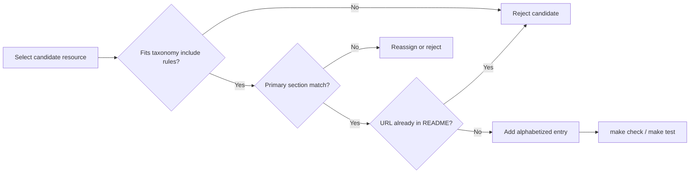

# PRD: Phase 7 Core Sections Expansion

## Introduction

Expand the three underfilled **core** README resource sections—**Theories**, **Coordination Patterns**, and **Frameworks**—so each meets a minimum density bar without weakening scope discipline. Phase 7 foundational seeding already placed entries in all ten curated sections on `main`; this batch deepens the conceptual backbone (theories), reusable topologies (patterns), and runnable orchestration software (frameworks) that readers rely on first when learning agent-factory design.

The concrete change: add at least **3** theories entries (5 → ≥8), **4** coordination-pattern entries (4 → ≥8), and **3** framework entries (5 → ≥8). Every addition must clearly fit [docs/taxonomy.md](../../docs/taxonomy.md) include rules and [CONTRIBUTING.md](../../CONTRIBUTING.md) submission rules, use canonical stable URLs, stay alphabetized by link text, avoid duplicate URLs anywhere in README.md, and describe resources factually with explicit ties to coordination, orchestration, delegation, routing, handoffs, shared state, or group-level evaluation.

## Context

### Customer ask

Phase 7 content expansion: extend the underfilled README core sections without weakening scope discipline. Expand Theories from 5 entries to at least 8, Coordination Patterns from 4 entries to at least 8, and Frameworks from 5 entries to at least 8. Add only high-signal resources that clearly fit docs/taxonomy.md and CONTRIBUTING.md, keep entries alphabetized, use canonical stable URLs where possible, avoid duplicates, and keep descriptions factual and explicitly tied to coordination, orchestration, delegation, routing, handoffs, shared state, or group-level evaluation.

### Problem

The three core sections that anchor agent-factory literacy—foundational theories, coordination topologies, and orchestration frameworks—remain thin relative to later Phase 7 sections (for example, Research Papers and Blog Posts). Readers and contributors lack enough on-main exemplars to compare category fit across conceptual models, pattern catalogs, and runnable multi-agent runtimes. Underfilled core sections also make it harder to defend scope boundaries when borderline submissions arrive, because there are fewer high-quality reference entries in each lane.

### Solution

Add curated, taxonomy-aligned entries only to the three target README sections. Preserve existing seed entries unless a merge conflict requires trivial hygiene. Do not modify governance prose (Scope, Contributing, Community), other curated sections, or category definitions in docs/taxonomy.md. Verify automated README checks (`make check`, `make test`) and whitespace hygiene (`git diff --check`) pass before merge.

## Goals

- Raise **Theories** to at least 8 entries covering diverse foundational ideas for organizing agent groups.
- Raise **Coordination Patterns** to at least 8 entries covering distinct reusable multi-agent topologies.
- Raise **Frameworks** to at least 8 entries covering distinct multi-agent orchestration software.
- Keep every new entry high-signal, non-promotional, scope-aligned, and alphabetized within its section.
- Pass all repository quality gates with no regressions to governance or unrelated README sections.

## Project-level acceptance criteria

- [ ] README **Theories** contains at least 8 resource entries (currently 5) using `- [Resource Name](URL) - Description.` format with descriptions ending in a period and entries alphabetized by link text.
- [ ] README **Coordination Patterns** contains at least 8 resource entries (currently 4) using the same format, tone, and alphabetization rules.
- [ ] README **Frameworks** contains at least 8 resource entries (currently 5) using the same format, tone, and alphabetization rules.
- [ ] Every new entry uses a stable canonical URL, fits docs/taxonomy.md include rules for its section, includes at least one agent-factory scope keyword in the description (coordination, orchestration, delegation, routing, handoffs, shared state, or group-level evaluation), and introduces no duplicate URLs anywhere in README.md.
- [ ] README governance sections (Scope, Contributing, Community) and all non-target curated sections remain unchanged except unavoidable whitespace or merge hygiene.
- [ ] Quality gate: `make check`, `make test`, and `git diff --check` all pass from the repository root.

## User Stories

### US-001: Expand Theories section to minimum density

**Description:** As a reader designing agent societies, I want more foundational theories indexed on main so I can compare enduring conceptual models for group organization, cooperation, and planning beyond the current five seed entries.

**Acceptance Criteria:**

- [x] README Theories contains at least 8 entries below the section intro (at least 3 new entries beyond the existing five: Actor Model, An Introduction to MultiAgent Systems, Blackboard Architecture, Contract Net Protocol, Swarm Intelligence).
- [x] Each new entry is a foundational idea for organizing agent groups per docs/taxonomy.md Theories include rules (for example role-based organization, hierarchical planning, BDI-style rational agents, stigmergic coordination, human–agent teaming, or market-based group allocation)—not a runnable SDK or pattern-only topology writeup.
- [x] Each entry uses exact format `- [Resource Name](URL) - Description.` with a factual one-sentence description ending in a period; description explicitly ties to coordination, orchestration, delegation, routing, handoffs, shared state, or group-level evaluation.
- [x] Entries are alphabetized by link text across the full section; no duplicate URLs are introduced anywhere in README.md.
- [x] `make check` passes after Theories expansion.
- [x] Typecheck passes.
- [x] Tests pass.

### US-002: Expand Coordination Patterns section to minimum density

**Description:** As a system architect choosing multi-agent topologies, I want more pattern references on main so I can study distinct orchestration shapes (supervision, routing, deliberation, pipelines, shared workspaces) beyond the current four seed entries.

**Acceptance Criteria:**

- [ ] README Coordination Patterns contains at least 8 entries below the section intro (at least 4 new entries beyond the existing four: Agent orchestration, AI Agent Orchestration Patterns, Building Effective Agents, Multi-agent).
- [ ] Each new entry documents a reusable multi-agent topology per docs/taxonomy.md Coordination Patterns include rules (for example supervisor-worker, planner-executor, router-specialist, debate, pipeline, hub-and-spoke, critic-reviewer, or shared-workspace coordination)—not a framework product page whose primary value is the software itself.
- [ ] Each entry uses exact format `- [Resource Name](URL) - Description.` with a factual one-sentence description ending in a period and an explicit agent-factory scope keyword.
- [ ] New URLs do not duplicate URLs already present elsewhere in README.md (including existing pattern docs and framework repos); entries are alphabetized by link text across the full section.
- [ ] `make check` passes after Coordination Patterns expansion.
- [ ] Typecheck passes.
- [ ] Tests pass.

### US-003: Expand Frameworks section to minimum density

**Description:** As a builder selecting orchestration software, I want more multi-agent frameworks indexed on main so I can compare distinct runtimes for delegation, handoffs, and group coordination beyond the current five seed entries.

**Acceptance Criteria:**

- [ ] README Frameworks contains at least 8 entries below the section intro (at least 3 new entries beyond the existing five: AutoGen, CrewAI, LangGraph, MetaGPT, Symphony).
- [ ] Each new entry is software whose core purpose is multi-agent coordination, orchestration, routing, or handoffs per docs/taxonomy.md Frameworks include rules—not a generic LLM SDK, single-agent chatbot framework, prompt library, or example-only repository already listed under Examples and Templates.
- [ ] Each entry uses exact format `- [Resource Name](URL) - Description.` with a factual one-sentence description ending in a period; description emphasizes orchestration, delegation, handoffs, or group coordination capabilities.
- [ ] New framework URLs point to canonical project homes (typically repository roots or official documentation roots), not duplicate URLs already in README.md; entries are alphabetized by link text across the full section.
- [ ] `make check` passes after Frameworks expansion.
- [ ] Typecheck passes.
- [ ] Tests pass.

### US-004: Verify batch quality gates and section integrity

**Description:** As a maintainer merging this batch, I want end-to-end verification that expanded core sections satisfy automated checks and leave unrelated repository content untouched.

**Acceptance Criteria:**

- [ ] From repository root, `make check` exits 0.
- [ ] From repository root, `make test` exits 0.
- [ ] `git diff --check` reports no whitespace errors on changed files.
- [ ] README Theories, Coordination Patterns, and Frameworks each contain at least 8 entries; combined they include at least 10 new entries relative to pre-batch counts.
- [ ] README Scope, Contributing, and Community sections remain present and unweakened; Protocols and Interfaces, Benchmarks, Research Papers, Blog Posts, Case Studies, Examples and Templates, and Related Lists contain no unintended edits.
- [ ] Changed content files are limited to README.md and planning artifacts for this batch.
- [ ] Typecheck passes.
- [ ] Tests pass.

## Functional Requirements

- FR-1: Add at least 3 new Theories entries so the section totals at least 8 alphabetized resources.
- FR-2: Add at least 4 new Coordination Patterns entries so the section totals at least 8 alphabetized resources.
- FR-3: Add at least 3 new Frameworks entries so the section totals at least 8 alphabetized resources.
- FR-4: Every new entry must satisfy CONTRIBUTING.md entry format, agent-factory relevance keywords enforced by `internal/checks`, and docs/taxonomy.md category include/exclude rules.
- FR-5: No README URL may appear more than once across all sections after this batch lands.
- FR-6: Existing seed entries in the three target sections remain unless an unavoidable merge requires trivial formatting hygiene; do not remove or rewrite entries to force alphabetization—insert new entries in correct sort order.

## Non-Goals

- Expanding Research Papers, Blog Posts, Case Studies, Examples and Templates, Protocols and Interfaces, Benchmarks, or Related Lists (handled by sibling Phase 7 batches).
- Rewriting docs/taxonomy.md category definitions or Phase 7 status prose unless a factual count correction is strictly required.
- Adding new top-level README sections or changing section headings.
- Broad README cleanup, URL audit, or removal of weak entries (handled by phase-7-source-quality-audit).
- Lowering scope discipline to hit count targets (quality and fit trump minimum counts).
- Meta-test planning such as inventorying registration files or asserting internal bundle structure.

## High-level technical design

This batch is a **content-only README expansion** validated by existing Phase 4 Go checks in `internal/checks`. No new packages, APIs, or UI are introduced.

**Change surface:** `README.md` sections `## Theories`, `## Coordination Patterns`, and `## Frameworks` only.

**Validation path:** `make check` runs structural validation (section headings, Contents alignment, entry format, description period, scope keywords, banned marketing phrases, alphabetization, duplicate URL detection). `make test` runs checker unit tests. CI mirrors these commands.

**Selection workflow for implementers:**

1. Identify gaps against docs/taxonomy.md representative examples not yet represented on main.
2. Confirm each candidate's **primary** contribution matches the target section (theory vs pattern vs framework).
3. Choose canonical stable URLs (Wikipedia or enduring references for theories; official pattern/architecture docs for patterns; repository or official docs roots for frameworks).
4. Draft one-sentence descriptions with an explicit scope keyword; avoid promotional wording.
5. Insert entries in alphabetized position; run `make check` after each section edit.

## Supporting technical and UX considerations

- **Category boundaries:** A CAMEL repository belongs in Frameworks; the CAMEL arXiv paper stays in Research Papers—use distinct URLs. A LangGraph concepts page may already be listed under Coordination Patterns; do not duplicate the same URL under Frameworks.
- **Description style:** Match existing seeded tone—one factual sentence ending with a period, emphasizing group coordination rather than product hype.
- **Stable URLs:** Prefer enduring references (Wikipedia, official docs, repository roots) over campaign landing pages or version-fragile deep links when equally canonical.
- **Alphabetization:** Sort by markdown link text, not URL or author name; re-read the full section after inserts.
- **Automated enforcement:** Scope keywords and description periods are enforced at check time; failing entries block merge.

## Success metrics

- Each of the three core sections reaches ≥8 entries with zero duplicate URLs and zero `make check` failures.
- New theories entries cover at least three distinct conceptual families not already represented (for example rational-agent modeling, hierarchical planning, stigmergy, or human–agent teaming).
- New pattern entries cover at least three distinct topologies not already represented by the four seed links.
- New framework entries represent at least three distinct orchestration products not already listed.
- No regression in CI README validation or contributor governance sections.

## Open Questions

None. Category definitions, entry format, and quality gates are documented; implementers should reject borderline candidates rather than expand scope.
