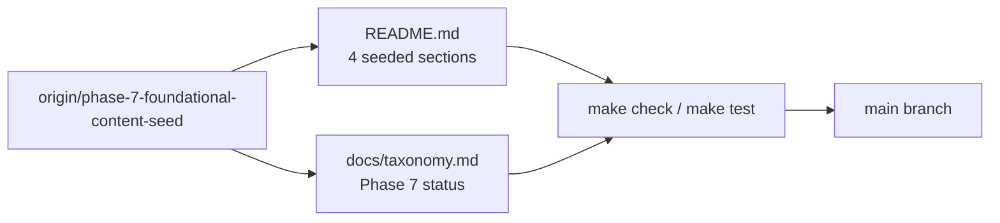

# PRD: Phase 7 Foundational Content Integration Repair

## Introduction

Converge the completed Phase 7 foundational content seed from `origin/phase-7-foundational-content-seed` onto `main`. Reapply the intended README resource entries for **Theories**, **Coordination Patterns**, **Frameworks**, and **Related Lists** so readers and contributors see exemplar curated content on the default branch. Update `docs/taxonomy.md` so its Phase 7 status note reflects that foundational seeding is now present on `main` for those four sections. Preserve README **Scope**, **Contributing**, and **Community** sections without weakening or rewriting them.

This is a narrow integration repair: land two file deltas (`README.md`, `docs/taxonomy.md`) that match the completed seed work, pass repository quality gates, and avoid unrelated documentation churn or new categories.

## Context

### Customer ask

Converge the completed Phase 7 foundational content seed onto main. Reapply the intended README additions for Theories, Coordination Patterns, Frameworks, and Related Lists from the completed `origin/phase-7-foundational-content-seed` work without weakening existing scope, contribution, or community sections. Keep entries canonical, factual, non-promotional, description-final-period compliant, and alphabetized within each section. Update `docs/taxonomy.md` so its Phase 7 status note reflects that foundational seeding is now present on main for those four sections. Keep the change narrow: do not start new categories, do not add extra docs churn, and keep `make check`, `make test`, and `git diff --check` passing.

### Problem

Phase 7 foundational content was completed on branch `phase-7-foundational-content-seed` but is not yet on `main`. The default branch still shows empty resource sections for the four seeded categories, and `docs/taxonomy.md` still states Phase 7 content seeding has not started. Contributors lack on-main exemplars for entry format, tone, category fit, and alphabetization.

### Solution

Integrate the seed branch README entries and taxonomy status update onto `main` as a focused repair batch. Copy the eighteen curated entries exactly as validated on the seed branch (or equivalent content meeting the same bar), verify automated README checks pass, and confirm Scope, Contributing, and Community prose remain intact.

## Goals

- Land all seed-branch entries for Theories, Coordination Patterns, Frameworks, and Related Lists on `main`
- Preserve README Scope, Contributing, and Community sections without semantic weakening
- Keep entries canonical, factual, non-promotional, period-terminated, and alphabetized by link text within each section
- Update `docs/taxonomy.md` Phase 7 status to state foundational seeding is present on `main` for the four seeded sections
- Leave deferred README sections empty (Protocols and Interfaces, Benchmarks, Research Papers, Blog Posts, Case Studies, Examples and Templates)
- Pass `make check`, `make test`, and `git diff --check` from the repository root

## Project-level acceptance criteria

- [ ] README **Theories**, **Coordination Patterns**, **Frameworks**, and **Related Lists** each contain the intended seed-branch entries (18 total) using `- [Resource Name](URL) - Description.` format
- [ ] Every description ends with a period, uses factual non-promotional tone, and states agent-factory relevance
- [ ] Entries within each seeded section are alphabetized by link text with no duplicate URLs in README.md
- [ ] README **Scope**, **Contributing**, and **Community** sections remain present and are not weakened, shortened, or contradicted
- [ ] Deferred README sections receive no new entries; no new categories or unrelated doc files are introduced
- [ ] `docs/taxonomy.md` Phase 7 status prose states foundational seeding is present on `main` for the four seeded sections and that other sections remain empty for later batches
- [ ] Quality gate: `make check`, `make test`, and `git diff --check` all pass from the repository root

## User Stories

### US-001: Integrate Theories entries onto main

**Description:** As a reader learning conceptual models for agent groups, I want foundational theory entries visible on `main` so I can study coordination and delegation ideas before choosing frameworks.

**Acceptance Criteria:**

- [x] README **Theories** contains five entries matching the seed branch: Actor Model, An Introduction to MultiAgent Systems, Blackboard Architecture, Contract Net Protocol, and Swarm Intelligence
- [x] Entries appear below the section intro in alphabetical order by link text
- [x] Each entry uses exact resource name as link text and a description ending with a period
- [x] `make check` passes after Theories integration
- [x] Typecheck passes
- [x] Tests pass

### US-002: Integrate Coordination Patterns entries onto main

**Description:** As a system designer, I want coordination-pattern documentation linked from `main` so I can compare supervisor, handoff, and routing topologies when designing agent flows.

**Acceptance Criteria:**

- [x] README **Coordination Patterns** contains four entries matching the seed branch: Agent orchestration, AI Agent Orchestration Patterns, Building Effective Agents, and Multi-agent
- [x] Entries appear below the section intro in alphabetical order by link text
- [x] Descriptions emphasize reusable coordination topology rather than promotional product language
- [x] `make check` passes after Coordination Patterns integration
- [x] Typecheck passes
- [x] Tests pass

### US-003: Integrate Frameworks entries onto main

**Description:** As a builder implementing agent factories, I want canonical multi-agent frameworks listed on `main` so I can evaluate orchestration runtimes for teams, handoffs, and flow control.

**Acceptance Criteria:**

- [x] README **Frameworks** contains five entries matching the seed branch: AutoGen, CrewAI, LangGraph, MetaGPT, and Symphony
- [x] Descriptions emphasize multi-agent orchestration, delegation, or handoff capabilities
- [x] Entries appear below the section intro in alphabetical order by link text
- [x] `make check` passes after Frameworks integration
- [x] Typecheck passes
- [x] Tests pass

### US-004: Integrate Related Lists entries onto main

**Description:** As a reader exploring the agent-factory ecosystem, I want complementary awesome lists indexed on `main` so I can discover broader curated resources without duplicating them in this list.

**Acceptance Criteria:**

- [x] README **Related Lists** contains four entries matching the seed branch: Awesome AI agents, Awesome Generative Multi-Agent Systems, Awesome Multi-Agent Learning, and Awesome Multi-Agent Papers
- [x] Link text uses each list's official title; entries are alphabetized by link text
- [x] `make check` passes after Related Lists integration
- [x] Typecheck passes
- [x] Tests pass

### US-005: Update taxonomy Phase 7 status for main convergence

**Description:** As a maintainer or factory operator tracking phase status, I want `docs/taxonomy.md` to reflect that Phase 7 foundational seeding is present on `main` so documentation matches repository state.

**Acceptance Criteria:**

- [ ] `docs/taxonomy.md` Phase 7 content-seeding prose states foundational seeding is **present on main** for Theories, Coordination Patterns, Frameworks, and Related Lists
- [ ] Taxonomy notes that Blog Posts, Case Studies, Benchmarks, Research Papers, Protocols and Interfaces, and Examples and Templates remain empty for later batches
- [ ] Category definitions, include/exclude rules, and README section headings in taxonomy are unchanged
- [ ] No new README entries are added in deferred sections as part of this story
- [ ] Typecheck passes

### US-006: Verify integration repair quality gates and section integrity

**Description:** As a maintainer merging the integration repair, I want end-to-end verification that seeded content landed correctly and repository gates pass without regressing governance sections.

**Acceptance Criteria:**

- [ ] From repository root, `make check` exits 0
- [ ] From repository root, `make test` exits 0
- [ ] `git diff --check` reports no whitespace errors on changed files
- [ ] README **Scope**, **Contributing**, and **Community** sections match pre-integration intent (present, unweakened, no contradictory edits)
- [ ] Deferred README sections contain no new resource entries
- [ ] Changed files are limited to `README.md`, `docs/taxonomy.md`, and planning artifacts—no unrelated cleanup
- [ ] Typecheck passes
- [ ] Tests pass

## Functional Requirements

- FR-1: Integrate eighteen README entries from `origin/phase-7-foundational-content-seed` across four sections (Theories: 5, Coordination Patterns: 4, Frameworks: 5, Related Lists: 4)
- FR-2: Enforce CONTRIBUTING.md entry format: exact resource name link text, canonical URL, hyphen-separated description ending with a period
- FR-3: Enforce alphabetical order by link text within each seeded section per automated checks in `internal/checks`
- FR-4: Preserve README Scope, Contributing, and Community sections without semantic weakening
- FR-5: Update `docs/taxonomy.md` Phase 7 status to document on-main presence for the four seeded sections
- FR-6: Leave six deferred README sections without new entries

## Non-Goals

- Seeding Blog Posts, Case Studies, Benchmarks, Research Papers, Protocols and Interfaces, or Examples and Templates
- Adding new README categories or restructuring the Contents block
- Rewriting CONTRIBUTING.md, review-policy.md, historical.md, or factory planner docs beyond the taxonomy status note
- Changing Go checker logic, Makefile targets, or GitHub workflows
- Link-checking external URLs (optional `make links` is out of scope unless CI requires it)
- Broad refactors, unrelated formatting sweeps, or marketing tone edits to seed entries

## High-level technical design

Integration is a two-file convergence from a completed feature branch:

**Source of truth:** `git diff main origin/phase-7-foundational-content-seed` for `README.md` and `docs/taxonomy.md` defines the intended delta (+22 / −1 lines).

**Validation layer:** `go run ./internal/checks` (via `make check`) enforces section headings, Contents alignment, entry format, description terminal periods, and alphabetization. `go test ./...` (via `make test`) guards checker regressions.

**Governance guard:** Scope, Contributing, and Community blocks are outside the seed diff and must remain unchanged in substance.

## Supporting technical and UX considerations

- Prefer cherry-picking or applying the seed-branch patch over reauthoring entries to avoid drift from reviewed content
- If a seed entry fails an automated check on current `main`, fix only that entry to meet the same canonical intent—do not rewrite unrelated sections
- Related Lists is a curated category section but is intentionally omitted from the Contents TOC; do not add it during integration
- Taxonomy status wording should say seeding is **present on main**, not merely "started in this batch," to reflect post-merge state
- No browser verification is required; observable outcomes are README rendering and automated check exit codes

## Success metrics

- All eighteen seed entries visible on `main` in the four target sections
- Zero automated README check failures after integration
- Zero whitespace errors from `git diff --check`
- Taxonomy Phase 7 status accurately describes on-main seeding state
- No contributor-facing regression in Scope, Contributing, or Community guidance

## Open Questions

None. The seed branch diff is the authoritative integration target; scope and file boundaries are explicit.
