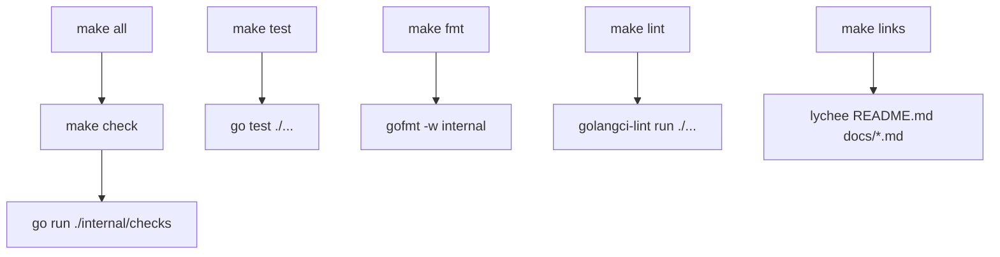

# PRD: Phase 4 Makefile and Lint Config

## Context

### Customer ask

Phase 4 automation integration: wire repository-level quality commands and config around the Go checker after `phase-4-go-readme-checker-core` lands. Add a root `Makefile` with the requested targets `all`, `lint`, `check`, `links`, `fmt`, and `test`; `all` should run `check`, `check` should run `go run ./internal/checks`, `fmt` should format Go checker code, and `test` should run `go test ./...`. Add `.golangci.yml`, `.markdownlint.yaml`, and `.lychee.toml` matching the customer ask where practical. Add `scripts/check-readme.sh` and `scripts/normalize-readme.sh` only if they help expose the same checker/formatting commands without duplicating logic. Preserve existing `.gitignore` and `.editorconfig` behavior, extending only when necessary for Go/build artifacts. Do not add GitHub Actions, issue templates, or content seeding. Acceptance: `make check`, `make test`, and `go test ./...` pass locally; optional external tools such as `golangci-lint` or `lychee` are documented or fail with clear missing-tool guidance; and root automation files match Phase 4 checklist names.

### Problem

The Go README checker from `phase-4-go-readme-checker-core` can validate structure and entry rules, but contributors and maintainers still lack a single, documented entry point for local quality checks. Without a root `Makefile` and aligned lint/link configuration, every contributor must remember raw `go run`, `go test`, and optional third-party tool invocations. Phase 5 CI cannot mirror repository conventions until Phase 4 checklist files exist at predictable paths with predictable behavior.

### Solution

Add the Phase 4 automation surface at the repository root: a `Makefile` that delegates `check` and `test` to the existing Go checker module, `fmt` to `gofmt` on checker code, `lint` to `golangci-lint`, and `links` to `lychee`; plus `.golangci.yml`, `.markdownlint.yaml`, and `.lychee.toml` aligned with `docs/internal/customer-ask.md`. Optional shell wrappers may thinly delegate to `make` targets when they improve discoverability without duplicating checker logic. Preserve current `.gitignore` and `.editorconfig` semantics, extending only for Go/build artifacts if the checker module introduces new local outputs.

## Introduction

This work item delivers **repository-level quality automation** for **Awesome AI Agent Factories**. It is the second Phase 4 deliverable and depends on `phase-4-go-readme-checker-core` landing first. The outcome is observable maintainer and contributor behavior: run `make check` before opening a pull request, run `make test` for Go regression coverage, optionally run `make lint` and `make links` when external tools are installed, and format checker code with `make fmt`.

## Project-level acceptance criteria

- [ ] Root `Makefile` exists with `.PHONY` targets `all`, `lint`, `check`, `links`, `fmt`, and `test` matching the Phase 4 checklist in `docs/internal/customer-ask.md`.
- [ ] `make all` runs `check`; `make check` runs `go run ./internal/checks`; `make test` runs `go test ./...`; `make fmt` runs `gofmt -w internal`.
- [ ] `make check`, `make test`, and `go test ./...` pass locally against the current Phase 1 README skeleton with empty resource sections.
- [ ] Root `.golangci.yml`, `.markdownlint.yaml`, and `.lychee.toml` exist and match the customer ask configuration where practical.
- [ ] `make lint` and `make links` either run successfully when `golangci-lint` and `lychee` are installed or exit non-zero with a clear message explaining the missing tool and how to install it.
- [ ] Existing `.gitignore` and `.editorconfig` behavior is preserved; any extensions cover only necessary Go/build artifacts without removing factory or monorepo ignore rules.
- [ ] No GitHub Actions workflows, issue/PR templates, bulk README entries, or unrelated repository refactors are added.
- [ ] Quality gate: `go build ./internal/checks` succeeds; `go test ./...` passes; `make check` and `make test` pass; optional-tool targets provide documented or self-explanatory missing-tool guidance.

## Goals

- Give contributors one canonical local command surface for README validation and Go tests.
- Align root automation file names and Makefile targets with the Phase 4 checklist so Phase 5 CI can mirror them.
- Keep optional third-party linters and link checkers usable without blocking core `make check` / `make test` workflows when tools are absent.
- Avoid duplicating checker logic in shell scripts; scripts delegate to `make` or `go run` when present.
- Preserve Phase 2 hygiene files (`.gitignore`, `.editorconfig`) unless Go tooling requires minimal extension.

## User stories

### phase-4-makefile-and-lint-config-001: Add Phase 4 root lint and link configuration files

**Description:** As a maintainer wiring Phase 4 automation, I want root linter and link-checker configuration files so `golangci-lint`, markdownlint consumers, and `lychee` share predictable repository defaults.

**Acceptance Criteria:**

- [ ] Root `.golangci.yml` exists with `run.timeout: 5m` and enables `govet`, `staticcheck`, `errcheck`, `ineffassign`, `unused`, `gofmt`, `gofumpt`, `revive`, and `misspell` with `issues.exclude-use-default: false`.
- [ ] Root `.markdownlint.yaml` exists with `MD013: false`, `MD033: false`, `MD041: false`, and `MD024.siblings_only: true`.
- [ ] Root `.lychee.toml` exists with `max_retries = 2`, `timeout = 20`, `accept = [200, 204, 206, 301, 302, 403, 429]`, and `exclude` entries for `localhost` and `127.0.0.1`.
- [ ] When `golangci-lint` is installed, `golangci-lint run --config .golangci.yml ./internal/...` completes against the current checker code without configuration parse errors.
- [ ] Typecheck passes

### phase-4-makefile-and-lint-config-002: Add Makefile core quality targets

**Description:** As a contributor preparing a pull request, I want `make check`, `make test`, `make fmt`, and `make all` so I can validate README rules and Go tests from the repository root without memorizing raw commands.

**Acceptance Criteria:**

- [ ] Root `Makefile` declares `.PHONY: all lint check links fmt test`.
- [ ] `make check` runs `go run ./internal/checks` and exits 0 against the current repository `README.md`.
- [ ] `make test` runs `go test ./...` and exits 0.
- [ ] `make fmt` runs `gofmt -w internal` and leaves checker Go files formatted.
- [ ] `make all` runs the `check` target (equivalent to `make check`).
- [ ] Typecheck passes
- [ ] Tests pass

### phase-4-makefile-and-lint-config-003: Wire lint target with golangci-lint and missing-tool guidance

**Description:** As a maintainer running optional Go static analysis, I want `make lint` to use the repository golangci config or tell me clearly how to install the tool when it is missing.

**Acceptance Criteria:**

- [x] `make lint` runs `golangci-lint run ./...` using the root `.golangci.yml` configuration.
- [x] When `golangci-lint` is not on `PATH`, `make lint` exits non-zero and prints a human-readable message naming the missing binary and at least one installation option (for example official install docs or `go install` path).
- [x] When `golangci-lint` is installed and checker code is clean, `make lint` exits 0.
- [ ] Typecheck passes

### phase-4-makefile-and-lint-config-004: Wire links target with lychee and missing-tool guidance

**Description:** As a maintainer checking documentation link health, I want `make links` to run lychee against README and docs markdown or fail clearly when lychee is not installed.

**Acceptance Criteria:**

- [x] `make links` runs `lychee README.md docs/*.md` (or equivalent invocation that honors root `.lychee.toml`).
- [x] When `lychee` is not on `PATH`, `make links` exits non-zero and prints a human-readable message naming the missing binary and at least one installation option.
- [x] When `lychee` is installed, `make links` executes using the repository `.lychee.toml` settings without configuration parse errors.
- [x] Typecheck passes

### phase-4-makefile-and-lint-config-005: Preserve and minimally extend repository hygiene files

**Description:** As a factory operator maintaining multiple worktrees, I want `.gitignore` and `.editorconfig` to keep their current factory and monorepo rules while ignoring any new Go build artifacts introduced by the checker module.

**Acceptance Criteria:**

- [ ] Existing `.gitignore` entries for `.claude`, `tasks/`, `docs/internal`, `factory/Makefile`, `factory/docs`, editor/OS artifacts, logs, `tmp/`, `dist/`, and `coverage.out` remain present and unchanged in meaning.
- [ ] `.editorconfig` content remains aligned with current Phase 2 behavior (UTF-8, LF, final newline, markdown trailing-whitespace exception, Go tabs, YAML/TOML/JSON/Markdown two-space indent).
- [ ] If the Go checker introduces local build outputs not already ignored, add only the minimal patterns needed (for example `bin/` or `*.test` binaries) without broad unrelated cleanup.
- [ ] Typecheck passes

### phase-4-makefile-and-lint-config-006: Add optional helper scripts that delegate to Makefile targets

**Description:** As a contributor or automation author expecting shell entry points, I want thin wrapper scripts that expose the same README check and formatting commands without reimplementing checker logic.

**Acceptance Criteria:**

- [x] If added, `scripts/check-readme.sh` exits with the same result as `make check` by delegating to `make check` or `go run ./internal/checks` without embedding duplicate validation rules.
- [x] If added, `scripts/normalize-readme.sh` exits with the same formatting outcome as `make fmt` by delegating to `make fmt` without embedding duplicate formatting logic.
- [x] If either script is omitted, `CONTRIBUTING.md` or the `Makefile` help text states that `make check` and `make fmt` are the canonical entry points.
- [x] Any added scripts are executable and runnable from the repository root.
- [x] Typecheck passes

### phase-4-makefile-and-lint-config-007: Document local quality commands for contributors

**Description:** As a contributor following `CONTRIBUTING.md`, I want documented local commands for README validation and optional lint/link checks so I can self-verify before maintainer review.

**Acceptance Criteria:**

- [ ] `CONTRIBUTING.md` includes a short **Local checks** section naming `make check`, `make test`, and `make all` as the primary pre-submit commands.
- [ ] The section notes that `make lint` requires `golangci-lint` and `make links` requires `lychee`, with install pointers or references to upstream install documentation.
- [ ] Documentation does not claim GitHub Actions or scheduled CI already enforce checks (Phase 5 scope).
- [ ] Typecheck passes

## Functional requirements

- **FR-1:** Provide root `Makefile` with targets `all`, `lint`, `check`, `links`, `fmt`, and `test`.
- **FR-2:** `all` depends on `check`; `check` runs `go run ./internal/checks`; `test` runs `go test ./...`; `fmt` runs `gofmt -w internal`.
- **FR-3:** `lint` runs `golangci-lint run ./...` against root `.golangci.yml`.
- **FR-4:** `links` runs `lychee` against `README.md` and `docs/*.md` using root `.lychee.toml`.
- **FR-5:** Root `.golangci.yml`, `.markdownlint.yaml`, and `.lychee.toml` match `docs/internal/customer-ask.md` Phase 4 examples where practical.
- **FR-6:** Missing optional tools (`golangci-lint`, `lychee`) produce clear stderr guidance and non-zero exit from the corresponding `make` target.
- **FR-7:** Preserve `.gitignore` and `.editorconfig` behavior; extend `.gitignore` only for necessary Go/build artifacts.
- **FR-8:** Optional `scripts/check-readme.sh` and `scripts/normalize-readme.sh` delegate to existing `make` or `go` commands without duplicating checker logic.
- **FR-9:** Document primary and optional local quality commands for contributors.

## Non-goals

- GitHub Actions workflows, issue templates, or PR templates (Phases 5–6).
- Bulk README resource seeding or taxonomy changes (Phase 7).
- Changing checker validation rules in `internal/checks` (owned by `phase-4-go-readme-checker-core`).
- Adding a `make` target for markdownlint execution unless a future phase requires it; this item delivers `.markdownlint.yaml` configuration only.
- Rewriting Phase 1–3 governance prose beyond documenting new local commands.
- Network-mandatory success for `make check` or `make test` (link checking remains optional via `make links`).

## High-level technical design

### Command ownership

| Surface | Responsibility |
|---------|----------------|
| `Makefile` | Canonical orchestration for `check`, `test`, `fmt`, `lint`, `links`, and `all` |
| `internal/checks` | README validation logic (pre-existing from core work item) |
| `.golangci.yml` | Go static analysis defaults for `make lint` |
| `.markdownlint.yaml` | Markdown lint defaults for editors and future CI |
| `.lychee.toml` | Link checker defaults for `make links` |
| `scripts/*.sh` | Optional thin delegation to `make` or `go run` |

### Makefile dependency graph

### Optional-tool failure contract

- Detect missing binaries with `command -v` (or Makefile equivalent) before invoking them.
- Print tool name, intended purpose, and install hint to stderr.
- Exit non-zero from the `make` target; do not fall back to silent skip unless documented as intentional (not required here).

### Side effects

- `make fmt` mutates Go source under `internal/` only.
- `make check`, `make test`, and `make lint` are read-only on source except compiled test caches.
- `make links` performs outbound HTTP requests when `lychee` is installed.

### Test layer

- No new Go validation logic; verification is command-outcome based.
- `make test` and `go test ./...` remain the regression gate for checker behavior.
- Optional-tool stories are verified by running targets with and without binaries installed.

### Prerequisite

- `phase-4-go-readme-checker-core` merged: root `go.mod`, `internal/checks`, and passing `go test ./...` / `go run ./internal/checks`.

## Supporting technical and UX considerations

- Keep Makefile recipes POSIX-friendly and readable; prefer explicit commands over nested shell complexity.
- Use repository-relative paths so commands work from a clean checkout at repo root.
- Do not add `factory/Makefile` to the root automation surface; existing `.gitignore` already excludes it.
- `.markdownlint.yaml` is configuration-only in this item; editors and Phase 5 CI can consume it later.
- `make links` may report broken external URLs; distinguish tool-missing failures from link failures in stderr wording.
- If helper scripts are added, use `set -euo pipefail` and `cd` to repo root via script location for predictable behavior.

## Success metrics

- A new contributor can run `make check` and `make test` successfully on first try after installing Go.
- `make lint` and `make links` failures clearly distinguish "tool not installed" from "check failed".
- Phase 5 CI can copy Makefile recipes without renaming targets or relocating config files.
- No duplicate README validation logic exists outside `internal/checks`.

## Open questions

None. Makefile target names, config file names, delegation rules, and scope boundaries are fully specified in the customer ask and Phase 4 checklist.
