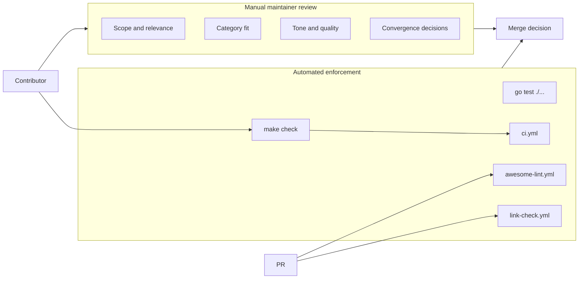

# PRD: Phase 6–7 Docs Convergence Cleanup

## Introduction

Reconcile repository-facing contributor docs and planner-facing factory docs with the now-merged Phase 1–6 state so Phase 7 content seeding starts from one coherent source of truth. This is a cleanup/reconciliation batch after Phase 6 template convergence review—not a new feature batch and not Phase 7 content work.

Phases 1–6 delivered README governance, taxonomy, review policy, Go README checks (`make check`), GitHub Actions (CI, link-check, awesome-lint, scheduled maintenance), and structured PR/issue templates. Several docs still describe pre-automation or pre-convergence reality: README Contents omits **Related Lists** while listing **Community** as navigation; `docs/review-policy.md` claims automation does not run; `docs/taxonomy.md` says Phase 4 is not implemented; and `factory/docs/overview.md` still describes an old AI model reference website with broken file references.

## Goals

- Align README Contents with the ten curated list categories, including **Related Lists**, without treating the **Community** footer as a curated content category.
- Update `docs/review-policy.md` to reflect the split between automated enforcement (local `make` targets, Go checks, GitHub workflows) and manual maintainer review (scope, quality, convergence).
- Keep `README.md`, `CONTRIBUTING.md`, `docs/review-policy.md`, and `docs/taxonomy.md` consistent on the ten categories and contributor submission path.
- Rewrite `factory/docs/overview.md` for **Awesome AI Agent Factories** and remove references to nonexistent paths.
- Leave `make check`, `go test ./...`, and `git diff --check` passing.

## User Stories

### US-001: Align README Contents with curated taxonomy

**Description:** As a reader browsing the list, I want the Contents navigation to reflect the ten curated resource sections—including Related Lists—so I can jump to any category without mistaking the Community footer for a list category.

**Acceptance Criteria:**

- [x] README `## Contents` links to all ten curated category headings: Theories, Coordination Patterns, Frameworks, Protocols and Interfaces, Benchmarks, Research Papers, Blog Posts, Case Studies, Examples and Templates, and Related Lists.
- [x] README `## Contents` includes **Related Lists** and does **not** include **Community** as a curated navigation item (the `## Community` section may remain at the document footer for conduct and security links).
- [x] README `## Contributing` prose states that contributors choose among the **ten curated categories** and does not describe Community as a submission category.
- [x] `make check` passes after Contents changes (update `internal/checks/sections.go` and tests only if required so Related Lists is no longer excluded from required Contents links).
- [x] Typecheck passes
- [x] Tests pass

### US-002: Modernize review policy for automation plus manual review

**Description:** As a maintainer or contributor reading review policy, I want an accurate description of what automation enforces today versus what still requires human judgment, so pre-submit self-checks and maintainer review align with repository reality.

**Acceptance Criteria:**

- [x] `docs/review-policy.md` opening states that automated checks exist via local `make` targets (`make check`, `make test`, `make links`), Go README validation in `internal/checks`, and GitHub workflows (`.github/workflows/ci.yml`, `link-check.yml`, `awesome-lint.yml`, `scheduled-maintenance.yml`), and that maintainers still perform manual review for scope fit, quality, category disputes, and convergence decisions.
- [x] Checklist item 8 (link stability) references automated link checking via `make links` and the Link Check workflow instead of claiming link checking is not enabled.
- [x] Triage label guidance for `needs-link-review` references automated link-check results where applicable rather than manual-only verification.
- [x] The "Future automation (Phase 4)" section is replaced or reframed to describe Phase 4 as implemented and to reserve future automation for items not yet covered (for example deeper scope-keyword warnings), without claiming automation is absent.
- [x] Recommended `resource:*` labels include **Related Lists** (for example `resource:related-list`) alongside the other nine category labels.
- [x] Typecheck passes

### US-003: Reconcile taxonomy and contributor docs on ten categories

**Description:** As a contributor choosing a README section, I want taxonomy, contributing, review policy, and README prose to name the same ten categories and submission path so I do not get conflicting guidance.

**Acceptance Criteria:**

- [x] `docs/taxonomy.md` category quick-reference table includes all ten README sections, including **Related Lists**, with a matching `resource:*` label column entry.
- [x] `docs/taxonomy.md` "Future automation" section states Phase 4 automated README checks and related CI are implemented; Phase 7 content seeding is not yet started in this batch.
- [x] `CONTRIBUTING.md` category list, PR template pointers, and local-checks / GitHub Actions subsections remain aligned with `README.md` section headings and `docs/review-policy.md` (no contradictory claims that GitHub Actions or Go checks are unconfigured).
- [x] `docs/review-policy.md` checklist section 2 lists the same ten categories as `CONTRIBUTING.md` and `docs/taxonomy.md`, including Related Lists.
- [x] No new README list entries or Phase 7 seed content are added.
- [x] Typecheck passes

### US-004: Rewrite factory overview for this repository

**Description:** As a factory operator or executor reading planner docs, I want `factory/docs/overview.md` to describe the Awesome AI Agent Factories repository and factory workflow so batch submission guidance points at real files and commands.

**Acceptance Criteria:**

- [x] `factory/docs/overview.md` describes coordinating work for **Awesome AI Agent Factories** (curated awesome list plus factory automation), not an AI model reference website or documentation site product.
- [x] "Read First" references only paths that exist in this repository (for example `factory/factory.json`, `factory/workstations/ideafy/AGENTS.md`, `factory/docs/batch-inputs.md`, `factory/docs/batch-input-example.json`, and `you docs agents` / `you docs batch-inputs` CLI outputs); remove or replace `docs/documentation-site-pages-needed.md` and other nonexistent documentation-site paths.
- [x] Phase control, work types, workstation flow, batch submission (`you submit batch`), state inspection, and repair guidance remain accurate for the checked-in `factory/factory.json` flow.
- [x] Local state file references use `docs/internal/` paths only when those files are part of the factory operator contract; otherwise point to `factory/docs/` equivalents documented in this repo.
- [x] Typecheck passes

### US-005: Verify doc reconciliation quality gates

**Description:** As a maintainer preparing the Phase 6–7 convergence review, I want automated quality gates to pass and whitespace checks to stay clean so the reconciliation branch is safe to merge before Phase 7 content seeding.

**Acceptance Criteria:**

- [x] From repository root, `make check` exits 0.
- [x] From repository root, `go test ./...` exits 0.
- [x] `git diff --check` reports no whitespace errors on changed files.
- [x] Changed files are limited to documentation reconciliation scope: `README.md`, `CONTRIBUTING.md` (only if needed for consistency), `docs/review-policy.md`, `docs/taxonomy.md`, `factory/docs/overview.md`, and minimal `internal/checks/` updates required by README Contents alignment.
- [x] No Phase 7 README resource entries are added.
- [x] Typecheck passes
- [x] Tests pass

## Functional Requirements

- FR-1: README Contents navigation lists Scope (if retained) and all ten curated category sections, including Related Lists; Community is not presented as a curated category in Contents.
- FR-2: `docs/review-policy.md` documents the automation/manual-review split with accurate references to `make` targets, Go checks, and GitHub workflows present on `main`.
- FR-3: `README.md`, `CONTRIBUTING.md`, `docs/review-policy.md`, and `docs/taxonomy.md` agree on the ten category names, Related Lists inclusion, and contributor submission path (one resource per PR, taxonomy for section fit, review policy for self-check).
- FR-4: `factory/docs/overview.md` describes this repository's factory and lists only valid file paths and CLI entry points.
- FR-5: Repository quality gates (`make check`, `go test ./...`, `git diff --check`) pass after reconciliation.

## Non-Goals

- Adding Phase 7 README content entries or seeding list resources.
- New GitHub templates, workflows, or checker features beyond minimal alignment required for `make check` after README Contents changes.
- Broad unrelated doc rewrites (`MAINTAINERS.md`, `docs/historical.md`, `docs/rejected.md`) unless a direct contradiction with the four core contributor docs is discovered during reconciliation.
- Planner-owned artifact changes (`prd.json`, `prd.md`, root `progress.txt`, `docs/internal/*`) unless explicitly required by a separate factory batch.

## High-Level Technical Design

Documentation-only reconciliation with at most a narrow Go checker adjustment:

1. **README Contents** — Update the Contents bullet list to include Related Lists and remove Community from curated navigation. Keep `## Community` at the footer for CODE_OF_CONDUCT and SECURITY links required by awesome-list conventions.
2. **Checker alignment** — If `internal/checks/sections.go` excludes Related Lists from required Contents links (`contentsExcludedSections`), remove that exclusion and update `internal/checks/sections_test.go` fixtures so `make check` validates the new Contents shape.
3. **Review policy** — Replace stale Phase 4 "not yet implemented" framing with a two-layer model: automation catches format, structure, duplicates, alphabetization, and link health; maintainers judge scope, relevance, category fit, tone, and merge readiness.
4. **Taxonomy cross-links** — Extend quick-reference and label tables to cover Related Lists; update Phase status prose to reflect Phase 4 complete and Phase 7 not started.
5. **Factory overview** — Retarget narrative and Read First paths to awesome-agent-factories factory docs; drop documentation-site scaffolding references.

## Supporting Technical and UX Considerations

- **awesome-lint Contents denylist** historically omitted Related Lists and Contributing from Contents while requiring Community. This batch prioritizes customer-visible taxonomy accuracy and `make check` alignment; if `npx awesome-lint` conflicts with adding Related Lists to Contents, prefer updating the Go checker and README together and document any awesome-lint follow-up separately rather than leaving Related Lists out of Contents.
- **Community section** remains at the README footer for conduct/security discoverability even when removed from Contents curated navigation.
- **CONTRIBUTING.md** already documents local checks and GitHub Actions accurately; changes should be limited to contradictions discovered during cross-doc review.
- Preserve encyclopedic tone and avoid marketing language in all edited prose.

## Success Metrics

- A contributor can name all ten curated categories from any of README, CONTRIBUTING, taxonomy, or review policy without finding conflicting lists.
- Review policy no longer tells maintainers that automation is absent when CI and `make check` are configured.
- Factory operators reading `factory/docs/overview.md` can follow Read First links without hitting missing files.
- `make check` and `go test ./...` pass on the reconciliation branch.

## Open Questions

None blocking implementation. awesome-lint Contents interaction with Related Lists inclusion will be resolved during US-001 by keeping `make check` green and noting any residual awesome-lint delta in story notes if it cannot be resolved within doc/checker scope.
