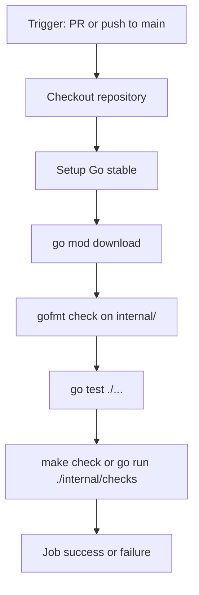

# PRD: Phase 5 Core CI Workflow

## Introduction

Add the core GitHub Actions continuous-integration workflow for **Awesome AI Agent Factories** so pull requests and pushes to `main` automatically run the same essential quality gates contributors already use locally. Phase 4 established `make check`, `make test`, and `go test ./...` as the local automation surface; Phase 5 closes the loop by enforcing those core checks in CI before maintainers review changes.

This work item creates **only** `.github/workflows/ci.yml`. It does not add link checking, awesome-lint, scheduled maintenance, issue templates, PR templates, or README content changes.

## Context

### Customer ask

Phase 5 GitHub Actions: add the core pull-request and main-branch CI workflow for the Awesome AI Agent Factories repository. Create `.github/workflows/ci.yml` only. It must run on pull requests to `main` and pushes to `main`; check out the repository; set up a stable Go version; download Go dependencies; check Go formatting for `internal`; run `go test ./...`; and run the custom README checks through the same command used by local automation, preferably `make check` or `go run ./internal/checks` if that is more reliable in CI. Keep the workflow read-only and non-mutating. Do not add link-check, awesome-lint, scheduled maintenance, issue templates, PR templates, or README content entries in this item.

### Problem

Contributors can self-verify with `make check` and `make test`, but maintainers have no automated gate on GitHub when a pull request is opened or when `main` is updated. Without CI, README rule regressions, Go test failures, and formatting drift can reach `main` undetected. Phase 4 local automation exists, but GitHub does not yet mirror it.

### Solution

Introduce a single read-only CI workflow at `.github/workflows/ci.yml` that triggers on pull requests and pushes targeting `main`, sets up stable Go on `ubuntu-latest`, downloads module dependencies, verifies `internal/` is gofmt-clean, runs `go test ./...`, and runs README validation through `make check` (falling back to `go run ./internal/checks` only if `make check` is unreliable in the runner environment). Use maintained GitHub Actions versions aligned with `docs/internal/customer-ask.md` (`actions/checkout@v4`, `actions/setup-go@v5`).

## Goals

- Enforce core Phase 4 quality gates automatically on every pull request to `main` and every push to `main`.
- Mirror local contributor commands (`make check`, `make test`, `go test ./...`, gofmt on `internal/`) without duplicating checker logic in the workflow.
- Keep CI strictly read-only: no formatting writes, commits, content mutation, or elevated write permissions.
- Leave optional Phase 4 targets (`make lint`, `make links`) and other Phase 5 workflows for separate work items.
- Preserve passing local gates: `make check`, `make test`, `go test ./...`, and `git diff --check`.

## Project-Level Acceptance Criteria

- [ ] `.github/workflows/ci.yml` exists as the only workflow file added by this work item.
- [ ] The workflow runs on `pull_request` to `main` and `push` to `main`.
- [ ] The workflow checks out the repository, sets up stable Go, runs `go mod download`, verifies `internal/` formatting, runs `go test ./...`, and runs README checks via `make check` or `go run ./internal/checks`.
- [ ] The workflow is read-only and non-mutating (no `gofmt -w`, commits, auto-fix bots, or content writes).
- [ ] The workflow uses current maintained GitHub Actions versions (`actions/checkout@v4`, `actions/setup-go@v5` or newer compatible majors).
- [ ] CI steps align with Phase 4 local gates documented in `CONTRIBUTING.md` and the root `Makefile`.
- [ ] Quality gate: `go build ./...` succeeds; `make check`, `make test`, `go test ./...`, and `git diff --check` pass locally after the workflow is added.

## User Stories

### phase-5-core-ci-workflow-001: CI workflow triggers and Go environment setup

**Description:** As a maintainer, I want a CI workflow that activates on pull requests and pushes to `main` and prepares a stable Go environment so automated checks run on every relevant change.

**Acceptance Criteria:**

- [ ] `.github/workflows/ci.yml` exists with workflow name `CI`.
- [ ] Workflow `on` includes `pull_request` with `branches: [main]` and `push` with `branches: [main]`.
- [ ] A single job runs on `ubuntu-latest`, checks out the repository with `actions/checkout@v4`, and sets up Go with `actions/setup-go@v5` using `go-version: stable`.
- [ ] A `go mod download` step runs after Go setup.
- [ ] Typecheck passes

### phase-5-core-ci-workflow-002: Go formatting verification in CI

**Description:** As a maintainer, I want CI to fail when checker code in `internal/` is not gofmt-formatted so formatting drift is caught before merge.

**Acceptance Criteria:**

- [ ] CI includes a format-check step equivalent to `test -z "$(gofmt -l internal)"` that exits non-zero when unformatted Go files exist under `internal/`.
- [ ] The format-check step does not write or modify files (no `gofmt -w`).
- [ ] The format check targets only `internal/`, matching local `make fmt` scope.
- [ ] Typecheck passes
- [ ] Tests pass

### phase-5-core-ci-workflow-003: Go test execution in CI

**Description:** As a contributor, I want CI to run the full Go test suite so checker regressions are caught the same way as `make test` locally.

**Acceptance Criteria:**

- [ ] CI includes a step that runs `go test ./...` from the repository root.
- [ ] The test step fails the workflow when any package test fails.
- [ ] The command matches the `make test` target behavior in the root `Makefile`.
- [ ] Typecheck passes
- [ ] Tests pass

### phase-5-core-ci-workflow-004: README checks in CI

**Description:** As a maintainer, I want CI to run the custom README validator so list structure and entry-rule violations are blocked before merge.

**Acceptance Criteria:**

- [ ] CI includes a README validation step that runs `make check` when `make` is available on the runner.
- [ ] If `make check` is unreliable in CI, the step uses `go run ./internal/checks` as a documented fallback with the same pass/fail semantics as local `make check`.
- [ ] The README check step fails the workflow when `internal/checks` reports failures against the repository `README.md`.
- [ ] The workflow does not invoke `make links`, `make lint`, lychee, awesome-lint, or other optional Phase 4/5 tools.
- [ ] Typecheck passes
- [ ] Tests pass

### phase-5-core-ci-workflow-005: Read-only CI guarantees and local gate regression check

**Description:** As a repository maintainer, I want the new CI workflow to remain non-mutating and leave existing local automation unchanged so contributors and CI share one consistent quality contract.

**Acceptance Criteria:**

- [ ] `.github/workflows/ci.yml` contains no steps that modify tracked files, create commits, open pull requests, or push changes.
- [ ] The workflow does not grant unnecessary `permissions:` write scopes; default read-only checkout behavior is sufficient.
- [ ] Only `.github/workflows/ci.yml` is added or changed for this work item (no link-check, awesome-lint, scheduled-maintenance, issue templates, PR templates, or README content edits).
- [ ] From a clean repository root, `make check`, `make test`, `go test ./...`, and `git diff --check` all exit 0 after the workflow lands.
- [ ] Typecheck passes
- [ ] Tests pass

## Functional Requirements

- **FR-1:** Add `.github/workflows/ci.yml` as the sole deliverable file for this work item.
- **FR-2:** Trigger the workflow on `pull_request` to `main` and `push` to `main`.
- **FR-3:** Use `actions/checkout@v4` to check out the triggering ref.
- **FR-4:** Use `actions/setup-go@v5` with `go-version: stable` compatible with `go 1.24` in `go.mod`.
- **FR-5:** Run `go mod download` before test and check steps.
- **FR-6:** Verify Go formatting with `test -z "$(gofmt -l internal)"` (or equivalent non-mutating check).
- **FR-7:** Run `go test ./...` from the repository root.
- **FR-8:** Run README validation via `make check`, preferring parity with local automation; use `go run ./internal/checks` only when `make check` is not reliable in CI.
- **FR-9:** Keep all workflow steps read-only and non-mutating.
- **FR-10:** Do not add workflows or templates outside the core CI scope defined in this PRD.

## Non-Goals

- No `.github/workflows/link-check.yml`, `.github/workflows/awesome-lint.yml`, or `.github/workflows/scheduled-maintenance.yml` (separate Phase 5 work item).
- No issue templates, PR templates, or GitHub App/bot integrations.
- No README content entries or taxonomy changes.
- No `make lint`, `make links`, golangci-lint, lychee, or awesome-lint in the core CI workflow.
- No workflow concurrency/caching optimizations unless required for correctness.
- No changes to checker validation rules in `internal/checks`.
- No mutation of repository content from CI (format fixes, normalize scripts, auto-commits).

## High-Level Technical Design

The workflow is a single job (`go-checks` or equivalent) on `ubuntu-latest` with a linear step sequence:

**Dependency alignment with Phase 4:**

| Local command | CI equivalent |
|---------------|---------------|
| `make fmt` / gofmt on `internal/` | `test -z "$(gofmt -l internal)"` (check only) |
| `make test` | `go test ./...` |
| `make check` | `make check` (preferred) or `go run ./internal/checks` |
| `make lint` | Not in scope |
| `make links` | Not in scope |

**Read-only contract:** Steps may read the working tree and module cache but must not run formatters with write flags, bots, or `git commit`/`git push`. The workflow should not set broad `permissions: write-all`.

**Action versioning:** Pin to maintained major versions from the customer ask (`checkout@v4`, `setup-go@v5`). Minor/patch updates within those majors are acceptable when they remain the current maintained release line.

## Supporting Technical Considerations

- `ubuntu-latest` GitHub-hosted runners include `make`; `make check` should work and keeps CI aligned with `CONTRIBUTING.md`.
- `go run ./internal/checks` is the canonical checker entry point inside the Go module and is acceptable as a fallback if `make` behavior differs unexpectedly.
- `go mod download` ensures module metadata is available before `go test` and `go run`.
- Format checking is intentionally limited to `internal/` because that is the Go code owned by this repository's checker; README formatting is validated by semantic rules, not gofmt.
- This work item should not require `go.sum` changes unless the module graph truly changes; adding CI alone should not alter dependencies.

## Success Metrics

- Every pull request to `main` receives an automatic CI run covering format, tests, and README checks.
- CI failure messages map clearly to the failing step (format, tests, or README checks).
- Contributors who pass `make check` and `make test` locally see green CI on equivalent changes.
- No increase in local maintainer burden: local commands remain the source of truth and continue to pass unchanged.

## Open Questions

None. Scope, triggers, steps, action versions, and exclusions are fully specified by the customer ask and `docs/internal/customer-ask.md`.
