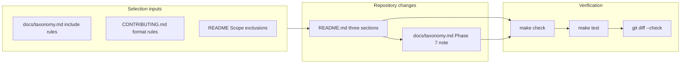

# PRD: Phase 7 Blog Posts, Case Studies, and Examples and Templates Seed

## Introduction

Complete the remaining Phase 7 foundational content seed for **Awesome AI Agent Factories** by populating the three still-empty README resource sections—**Blog Posts**, **Case Studies**, and **Examples and Templates**—with high-confidence, scope-aligned exemplar entries. Seven curated sections (Theories, Coordination Patterns, Frameworks, Protocols and Interfaces, Benchmarks, Research Papers, and Related Lists) are already seeded on `main`. This batch gives readers and contributors durable examples of technical writing, real deployment narratives, and runnable multi-agent coordination artifacts without revisiting sections that already have seed content.

## Context

### Customer ask

Advance the unfinished Phase 7 README sections now that Theories, Coordination Patterns, Frameworks, Protocols and Interfaces, Benchmarks, Research Papers, and Related Lists are already seeded on `main`. Add coherent first seeds for Blog Posts (roughly 4–6 entries), Case Studies (roughly 3–5 entries), and Examples and Templates (roughly 4–6 entries). Keep entries factual, neutral, non-promotional, alphabetized within each section, and formatted as `- [Resource Name](URL) - Description.` with descriptions ending in periods. Use stable, direct resource URLs scoped to groups of agents or agent-flow management. Update `docs/taxonomy.md` so its Phase 7 status note reflects that Blog Posts, Case Studies, and Examples and Templates are now seeded on `main`. Leave `make check`, `make test`, and `git diff --check` passing.

### Problem

Readers browsing `main` see empty Blog Posts, Case Studies, and Examples and Templates sections despite mature seed content in the other seven curated categories. Contributors lack on-main exemplars for category fit, tone, and entry format in these three sections. `docs/taxonomy.md` still defers Blog Posts, Case Studies, and Examples and Templates to a later batch, which no longer matches repository intent once this work lands.

### Solution

Add a focused, two-file content seed: populate each of the three empty README sections with curated entries that satisfy [docs/taxonomy.md](../../docs/taxonomy.md) include rules and [CONTRIBUTING.md](../../CONTRIBUTING.md) formatting rules, then update the Phase 7 status paragraph in `docs/taxonomy.md` to record that all ten curated README resource sections are seeded on `main`. Preserve Scope, Contributing, and Community prose. Do not modify already-seeded sections or add unrelated documentation churn.

## Goals

- Seed **Blog Posts** with 4–6 high-confidence technical articles about real multi-agent architectures, orchestration patterns, evaluation, or failure analysis.
- Seed **Case Studies** with 3–5 stable entries describing real-world deployments or sustained operational use of multiple agents or explicit agent flows.
- Seed **Examples and Templates** with 4–6 runnable or forkable examples focused on multi-agent coordination, handoffs, orchestration, or shared work patterns.
- Keep every added entry factual, neutral, alphabetized by link text, and compliant with the canonical entry format.
- Update `docs/taxonomy.md` Phase 7 status prose to reflect completion of seeding for Blog Posts, Case Studies, and Examples and Templates on `main`.
- Pass repository quality gates (`make check`, `make test`, `git diff --check`) without regressing automated README validators.

## Project-level acceptance criteria

- [ ] README **Blog Posts** contains 4–6 curated entries below the existing section intro, each using `- [Resource Name](URL) - Description.` with descriptions ending in a period.
- [ ] README **Case Studies** contains 3–5 curated entries below the existing section intro, using the same entry format and tone rules.
- [ ] README **Examples and Templates** contains 4–6 curated entries below the existing section intro, using the same entry format and tone rules.
- [ ] Every new entry is alphabetized by link text within its section, uses a stable direct URL, stays factual and non-promotional, and clearly addresses multi-agent coordination, orchestration, handoffs, or group-level agent flows rather than generic single-agent tooling.
- [ ] Already-seeded README sections (Theories, Coordination Patterns, Frameworks, Protocols and Interfaces, Benchmarks, Research Papers, Related Lists) and governance sections (Scope, Contributing, Community) are unchanged except where unavoidable for whitespace or merge hygiene.
- [ ] `docs/taxonomy.md` Phase 7 status note states that Blog Posts, Case Studies, and Examples and Templates are seeded on `main` and that Phase 7 foundational content seeding is complete across all ten curated README resource sections.
- [ ] Quality gate: `make check`, `make test`, and `git diff --check` all pass from the repository root.

## User Stories

### phase-7-blog-posts-case-studies-examples-seed-001: Seed Blog Posts section

**Description:** As a reader learning from production multi-agent experience, I want technical blog posts linked from the README so I can study real architectures, orchestration lessons, evaluation approaches, and failure analyses.

**Acceptance Criteria:**

- [ ] README Blog Posts contains 4–6 new entries placed below the existing section intro line and above the next `##` heading.
- [ ] Each entry uses exact format `- [Resource Name](URL) - Description.` with the resource name as link text and a description ending in a period.
- [ ] Entries are alphabetized by link text (case-insensitive) and cover technical multi-agent topics such as architecture breakdowns, orchestration patterns, group-workflow evaluation, or failure/postmortem analysis—not product launch posts or shallow trend pieces.
- [ ] No duplicate URLs are introduced anywhere in README.md.
- [ ] `make check` passes after Blog Posts seeding.
- [ ] Typecheck passes.
- [ ] Tests pass.

### phase-7-blog-posts-case-studies-examples-seed-002: Seed Case Studies section

**Description:** As a practitioner evaluating agent-factory adoption, I want real deployment case studies indexed on main so I can compare how organizations operate multiple agents or explicit agent flows in production.

**Acceptance Criteria:**

- [ ] README Case Studies contains 3–5 new entries placed below the existing section intro line and above the next `##` heading.
- [ ] Each entry uses exact format `- [Resource Name](URL) - Description.` with factual, encyclopedic descriptions ending in a period.
- [ ] Entries are alphabetized by link text and describe real-world or sustained operational use where multiple agents or explicit flows were central—not hypothetical architectures or single-chatbot support stories.
- [ ] No duplicate URLs are introduced anywhere in README.md.
- [ ] `make check` passes after Case Studies seeding.
- [ ] Typecheck passes.
- [ ] Tests pass.

### phase-7-blog-posts-case-studies-examples-seed-003: Seed Examples and Templates section

**Description:** As a builder starting a multi-agent project, I want runnable or forkable examples linked from the README so I can adapt coordination, handoff, and orchestration patterns without guessing category fit.

**Acceptance Criteria:**

- [ ] README Examples and Templates contains 4–6 new entries placed below the existing section intro line and above the next `##` heading.
- [ ] Each entry uses exact format `- [Resource Name](URL) - Description.` with descriptions ending in a period and emphasizing runnable or forkable multi-agent coordination artifacts.
- [ ] Entries are alphabetized by link text and point to repositories, notebooks, or templates readers can run or adapt—not production frameworks (which belong in Frameworks) or pattern-only documentation (which belongs in Coordination Patterns).
- [ ] No duplicate URLs are introduced anywhere in README.md.
- [ ] `make check` passes after Examples and Templates seeding.
- [ ] Typecheck passes.
- [ ] Tests pass.

### phase-7-blog-posts-case-studies-examples-seed-004: Update taxonomy Phase 7 status for completed seeding

**Description:** As a maintainer or contributor checking phase status, I want `docs/taxonomy.md` to reflect that Blog Posts, Case Studies, and Examples and Templates are seeded on `main` so documentation matches repository state.

**Acceptance Criteria:**

- [ ] `docs/taxonomy.md` Phase 7 content-seeding paragraph states that Blog Posts, Case Studies, and Examples and Templates are seeded on `main`.
- [ ] The same paragraph records that Phase 7 foundational content seeding is present on `main` for all ten curated README resource sections (Theories through Related Lists).
- [ ] Category definitions, include/exclude rules, representative examples, and README section headings elsewhere in taxonomy are unchanged.
- [ ] No new README entries are added outside the three sections seeded in earlier stories.
- [ ] Typecheck passes.

### phase-7-blog-posts-case-studies-examples-seed-005: Verify batch quality gates and section integrity

**Description:** As a maintainer merging this batch, I want end-to-end verification that seeded content satisfies automated README checks and repository gates without regressing governance sections.

**Acceptance Criteria:**

- [ ] From repository root, `make check` exits 0 (entry format, alphabetization, required sections, and Contents alignment all pass).
- [ ] From repository root, `make test` exits 0.
- [ ] `git diff --check` reports no whitespace errors on changed files.
- [ ] README Scope, Contributing, and Community sections remain present and unweakened.
- [ ] Already-seeded sections (Theories, Coordination Patterns, Frameworks, Protocols and Interfaces, Benchmarks, Research Papers, Related Lists) contain no unintended edits.
- [ ] Changed files are limited to `README.md`, `docs/taxonomy.md`, and planning artifacts for this batch.
- [ ] Typecheck passes.
- [ ] Tests pass.

## Functional Requirements

- **FR-1:** Add 4–6 Blog Posts entries covering technical multi-agent writing (architecture, orchestration, evaluation, or failure analysis) per [docs/taxonomy.md](../../docs/taxonomy.md#blog-posts) include rules.
- **FR-2:** Add 3–5 Case Studies entries documenting real deployments or sustained operational multi-agent or agent-flow use per [docs/taxonomy.md](../../docs/taxonomy.md#case-studies) include rules.
- **FR-3:** Add 4–6 Examples and Templates entries linking runnable or forkable multi-agent coordination artifacts per [docs/taxonomy.md](../../docs/taxonomy.md#examples-and-templates) include rules.
- **FR-4:** Every entry must use `- [Resource Name](URL) - Description.` format with descriptions ending in a period.
- **FR-5:** Entries within each seeded section must be alphabetized by link text (case-insensitive), matching automated `alphabetical-order` validation in [`internal/checks`](../../internal/checks).
- **FR-6:** Prefer stable repository or documentation URLs over transient announcement pages; skip borderline promotional or single-agent resources.
- **FR-7:** Update only the Phase 7 status paragraph in `docs/taxonomy.md`; do not rewrite category taxonomy content.
- **FR-8:** Do not add entries to or modify content in already-seeded README sections.

## Non-Goals

- Revisiting or expanding entries in Theories, Coordination Patterns, Frameworks, Protocols and Interfaces, Benchmarks, Research Papers, or Related Lists.
- Adding new README categories or changing Contents navigation structure.
- Modifying automated check logic in `internal/checks` unless a genuine validator bug blocks compliant seed content.
- Running or maintaining linked third-party example repositories.
- Link-checking every external URL locally (CI Link Check handles that separately).
- Seeding prompt collections, single-agent chatbot demos, or generic LLM SDK tutorials.

## High-level technical design

This batch is a documentation-only content seed with no runtime services, APIs, or UI. Implementation touches two canonical files:

**Resource selection workflow (per section):**

1. Identify candidates with durable homes (official docs, engineering blogs with technical depth, case-study writeups with deployment narrative, or forkable example repos).
2. Confirm each candidate fits README scope (groups of agents or flows) and the target taxonomy category include rules; reject single-agent or promotional material.
3. Draft descriptions that state the multi-agent coordination angle in neutral encyclopedic tone.
4. Alphabetize by link text, insert below the section intro, and run `make check` to catch format or ordering violations.

**Automated enforcement:** Phase 4 checks in `internal/checks` validate required section headings, Contents alignment, entry format, duplicate URLs, and per-section alphabetical order. Phase 5 CI runs equivalent gates. Implementers verify locally with `make check` and `make test`.

## Supporting technical and editorial considerations

- **Category boundaries:** A framework tutorial repo belongs in Examples and Templates only when the primary value is a runnable demo; full frameworks stay in Frameworks. Architecture articles about live systems belong in Blog Posts; deployment narratives with customer/operational context belong in Case Studies.
- **Overlap with existing entries:** Do not duplicate URLs already present elsewhere in README.md. If a resource is already listed under Frameworks or Coordination Patterns, choose a different candidate unless the same URL genuinely belongs in two categories (avoid duplicates).
- **Description style:** Match existing seeded sections—one sentence, coordination-focused, ending with a period. Example tone from Frameworks: emphasis on orchestration, delegation, handoffs, or group coordination.
- **Section intros:** Preserve the existing one-line intros under each `##` heading; add entries below them.
- **Taxonomy wording:** Replace the deferred-batch language in the Phase 7 paragraph with a completion statement covering all ten curated resource sections, linking each section name to its README anchor where the existing note already uses that pattern.

## Success metrics

- All three previously empty README sections contain qualifying seed entries within the requested count ranges.
- `make check` reports zero failures for entry format, alphabetization, and section structure on the updated README.
- Contributors can open any seeded entry and immediately see the expected list format, tone, and multi-agent scope without maintainer clarification.
- `docs/taxonomy.md` Phase 7 status accurately describes on-main seeding completeness with no deferred-section language for Blog Posts, Case Studies, or Examples and Templates.

## Open Questions

None. Selection criteria, entry counts, format rules, taxonomy update intent, and quality gates are fully specified by the customer ask and existing repository documentation.
