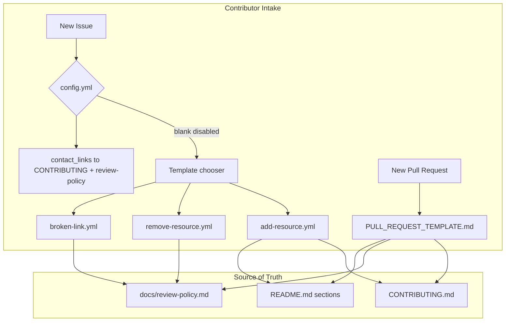

# PRD: Community Submission Templates (Phase 6)

## Introduction

Add the missing GitHub pull request and issue templates so contributors are guided toward **Awesome AI Agent Factories** scope, submission format, and maintainer review expectations before they open issues or pull requests.

Phases 1–5 established README structure, governance docs, review policy, local Go checks, and GitHub Actions. Phase 6 is the next customer-facing gap: there is no `.github/PULL_REQUEST_TEMPLATE.md`, no structured issue intake for add/remove/broken-link reports, and no `config.yml` to disable blank issues or route contributors to [CONTRIBUTING.md](CONTRIBUTING.md) and [docs/review-policy.md](docs/review-policy.md).

This batch delivers templates only. It does not add README list entries or unrelated repository changes.

## Context

### Customer ask

Add GitHub PR and issue templates aligned with existing contribution and review guidance so community submissions are scoped, factual, and review-ready.

### Problem

Contributors currently open blank issues and unstructured pull requests. Maintainers must repeatedly ask for resource name, canonical URL, README section, agent-factory relevance, one-resource-per-PR confirmation, format compliance, and link-health details. Phase 6 checklist items in [docs/internal/checklist.md](docs/internal/checklist.md) remain unchecked.

### Solution

Introduce a PR template and three issue templates plus `config.yml` that:

- Collect the fields maintainers need per [docs/review-policy.md](docs/review-policy.md)
- Reinforce one-resource-per-PR, scope, format, alphabetization, duplicate avoidance, and non-promotional tone from [CONTRIBUTING.md](CONTRIBUTING.md)
- Route issue authors away from blank issues toward contribution docs and the correct template
- Update [CONTRIBUTING.md](CONTRIBUTING.md) or [README.md](README.md) only when wording must stay consistent with new templates

## Goals

- Give contributors a structured PR checklist before resource submissions merge
- Provide issue templates for proposing additions, requesting removals, and reporting broken or suspicious links
- Disable blank issues and surface links to contribution and review documentation
- Keep all template copy factual, concise, and consistent with list scope and tone rules
- Advance Phase 6 in the internal checklist without adding README content

## Project-Level Acceptance Criteria

- [ ] `.github/PULL_REQUEST_TEMPLATE.md` exists and aligns with [CONTRIBUTING.md](CONTRIBUTING.md), [README.md](README.md), and [docs/review-policy.md](docs/review-policy.md)
- [x] `.github/ISSUE_TEMPLATE/add-resource.yml` collects resource name, URL, README section, and agent-factory fit rationale
- [ ] `.github/ISSUE_TEMPLATE/remove-resource.yml` supports dead links, out-of-scope resources, archived projects, and misleading descriptions
- [ ] `.github/ISSUE_TEMPLATE/broken-link.yml` collects enough detail for maintainers to verify broken or suspicious links
- [ ] `.github/ISSUE_TEMPLATE/config.yml` disables blank issues and routes contributors to contribution and review docs
- [ ] Template wording is factual, concise, non-promotional, and consistent with one-resource-per-PR discipline
- [ ] Related docs are updated only when needed to keep template guidance consistent with current reviewer policy
- [ ] Quality gate: `make check`, `make test`, and `git diff --check` pass from repository root

## User Stories

### US-001: Configure issue template chooser and contributor routing

**Description:** As a contributor, I want GitHub to block blank issues and point me to the right contribution docs and issue types so I do not open unstructured reports.

**Acceptance Criteria:**

- [x] `.github/ISSUE_TEMPLATE/config.yml` sets `blank_issues_enabled: false`
- [x] `contact_links` include at least one link to [CONTRIBUTING.md](CONTRIBUTING.md) and one to [docs/review-policy.md](docs/review-policy.md) with factual, concise `about` text
- [x] Config does not reference issue templates that are not present in the same change set once later stories land
- [x] Typecheck passes

### US-002: Add issue template for proposing a new resource

**Description:** As a contributor, I want a structured issue form to propose a resource before opening a pull request so maintainers can confirm scope and section fit early.

**Acceptance Criteria:**

- [x] `.github/ISSUE_TEMPLATE/add-resource.yml` defines a template titled for adding a resource with neutral description text (no promotional language)
- [x] Required fields: resource name (official title), canonical URL, README section, and why the resource fits agent-factory scope (groups of agents or flows)
- [x] README section is a dropdown covering all ten README sections: Theories, Coordination Patterns, Frameworks, Protocols and Interfaces, Benchmarks, Research Papers, Blog Posts, Case Studies, Examples and Templates, Related Lists
- [x] Template body reminds contributors that pull requests must add one resource only and links to [CONTRIBUTING.md](CONTRIBUTING.md)
- [x] Typecheck passes

### US-003: Add issue template for resource removal requests

**Description:** As a contributor or maintainer, I want a structured issue form to request removal or relocation when an entry is dead, out of scope, archived, or misleading.

**Acceptance Criteria:**

- [ ] `.github/ISSUE_TEMPLATE/remove-resource.yml` defines a template for removal or relocation requests with factual description text
- [ ] Required fields include: affected resource name, README section or link text as listed, canonical URL, and reason for removal
- [ ] Reason is a dropdown or required field covering at least: dead link, out of scope, archived project, misleading description (contributor may add detail in a textarea)
- [ ] Optional field for suggested outcome (remove outright, relocate to `docs/historical.md`) references [docs/review-policy.md](docs/review-policy.md) removal guidance without duplicating the full policy
- [ ] Typecheck passes

### US-004: Add issue template for broken or suspicious link reports

**Description:** As a contributor, I want to report broken or suspicious links with verifiable detail so maintainers can confirm link health and apply the `broken-link` outcome when appropriate.

**Acceptance Criteria:**

- [ ] `.github/ISSUE_TEMPLATE/broken-link.yml` defines a template for broken or suspicious link reports
- [ ] Required fields include: affected resource name (as shown in README link text), URL as listed in README, observed behavior (for example HTTP error, redirect to unrelated page, domain mismatch), and when the problem was observed
- [ ] Template asks whether the contributor verified the URL is still dead or suspicious after a recheck, aligned with [docs/review-policy.md](docs/review-policy.md) link-stability guidance
- [ ] Template copy stays factual and avoids accusing projects without evidence; points security concerns to [SECURITY.md](SECURITY.md)
- [ ] Typecheck passes

### US-005: Add pull request template for resource submissions

**Description:** As a contributor opening a resource pull request, I want a PR template that collects submission metadata and self-check acknowledgements so my change matches maintainer review expectations.

**Acceptance Criteria:**

- [ ] `.github/PULL_REQUEST_TEMPLATE.md` exists and uses markdown sections (not YAML front matter required for default PR templates)
- [ ] Template collects: resource name, resource URL, target README section, and why the resource belongs (agent-factory relevance)
- [ ] Template includes explicit acknowledgement checkboxes or bullet prompts for: one resource only, scope fit, entry format (`- [Resource Name](URL) - Description.`), factual non-promotional description, description ends with a period, alphabetical placement, duplicate URL check, and live canonical link verified
- [ ] Template links to [CONTRIBUTING.md](CONTRIBUTING.md), [docs/taxonomy.md](docs/taxonomy.md), and [docs/review-policy.md](docs/review-policy.md) for self-check before review
- [ ] Template reminds contributors to run `make check` (and `make links` when URLs change) before requesting review
- [ ] Wording matches [CONTRIBUTING.md](CONTRIBUTING.md) tone: concise, encyclopedic, non-promotional
- [ ] Typecheck passes

### US-006: Align contribution docs with new templates (only if needed)

**Description:** As a contributor reading [CONTRIBUTING.md](CONTRIBUTING.md) or [README.md](README.md), I want any references to issue/PR intake to match the new templates so guidance is not contradictory.

**Acceptance Criteria:**

- [ ] If [CONTRIBUTING.md](CONTRIBUTING.md) or [README.md](README.md) already mention opening issues or pull requests, update only those sentences to reference the new GitHub templates and chooser flow
- [ ] If no doc changes are required for consistency, record that outcome in the pull request description (no gratuitous edits)
- [ ] No README resource entries are added or modified in this story
- [ ] No unrelated governance, workflow, or planner-owned file changes
- [ ] Typecheck passes

### US-007: Verify Phase 6 template delivery and quality gates

**Description:** As a maintainer preparing Phase 6 convergence review, I want all five template artifacts present, internally consistent, and passing local quality gates so Phase 7 content work can start.

**Acceptance Criteria:**

- [ ] All required files exist: `.github/PULL_REQUEST_TEMPLATE.md`, `.github/ISSUE_TEMPLATE/config.yml`, `add-resource.yml`, `remove-resource.yml`, `broken-link.yml`
- [ ] Issue template YAML files parse as valid GitHub issue forms (required `name`, `description`, `body` with recognized field types)
- [ ] Template field labels and help text remain factual and non-promotional; one-resource-per-PR rule is stated in both PR template and add-resource issue template
- [ ] From repository root: `make check`, `make test`, and `git diff --check` exit 0
- [ ] No README list entries, workflow changes, or bulk unrelated edits are introduced in this batch
- [ ] Typecheck passes
- [ ] Tests pass

## Functional Requirements

- **FR-1:** GitHub must not offer blank issues; contributors choose a template or follow contact links to contribution docs.
- **FR-2:** Add-resource issues must capture name, URL, section, and scope rationale sufficient for maintainers to apply review-policy questions 1–4.
- **FR-3:** Remove-resource issues must capture identity of the listed entry and a removal trigger aligned with [docs/review-policy.md](docs/review-policy.md) removal table.
- **FR-4:** Broken-link issues must capture URL, README link text, observed failure mode, and recheck status for manual verification.
- **FR-5:** Pull request template must surface all acknowledgement items listed in Phase 6 checklist (one resource, scope, format, tone, punctuation, alphabetization, duplicates, live link).
- **FR-6:** Section dropdown values must match README section headings exactly.
- **FR-7:** Doc updates are limited to consistency fixes in [CONTRIBUTING.md](CONTRIBUTING.md) and [README.md](README.md); no new categories or list content.

## Non-Goals

- Adding or editing README resource entries
- New GitHub Actions workflows or template-validation automation
- Changing Go checker rules in `internal/checks`
- Creating labels in GitHub (templates may suggest labels in YAML but label creation is out of scope)
- Modifying planner-owned artifacts (`prd.json`, `prd.md`, `progress.txt`, `docs/internal/checklist.md`) unless the factory workflow explicitly requires it in a separate step
- Translations or multiple locale variants of templates

## High-Level Technical Design

This is a documentation-and-intake artifact batch with no application runtime changes.

**Package ownership:** `.github/` owns template files; [CONTRIBUTING.md](CONTRIBUTING.md) and [README.md](README.md) remain the canonical prose for rules—templates summarize and link, not redefine policy.

**Contracts:** GitHub issue form YAML (`body` field list) and default PR template markdown. Section names and acknowledgement prompts must stay aligned with Go checker expectations (entry format, punctuation, banned phrases) without embedding checker implementation details.

**Verification layer:** Human review of template copy plus repository quality gates (`make check`, `make test`). No meta-tests that assert file inventories beyond the behavioral presence criteria in US-007.

## Supporting Technical and UX Considerations

- Use GitHub issue form field types: `input`, `textarea`, `dropdown`, `checkboxes`, `markdown` for static guidance blocks.
- Prefer short `description` strings on templates; put longer rules in `markdown` body blocks with links to existing docs.
- PR template checkboxes use `- [ ]` markdown task syntax so contributors toggle them in the GitHub editor.
- Avoid marketing adjectives in template placeholders; use neutral examples (supervisor-worker orchestration, handoff protocols).
- `add-resource.yml` should state that issues are optional pre-flight; the actual list change still requires a one-resource pull request.
- `broken-link.yml` should distinguish routine dead links from security concerns ([SECURITY.md](SECURITY.md)).

## Success Metrics

- New issues on the repository use one of the three templates rather than blank issues
- Resource pull requests include completed PR template sections before maintainer review
- Fewer review round-trips asking for missing URL, section, or agent-factory justification
- Phase 6 checklist template items can be marked complete after merge

## Open Questions

None blocking implementation. Section dropdown labels and acknowledgement wording are fully determined by existing README headings and [CONTRIBUTING.md](CONTRIBUTING.md).
