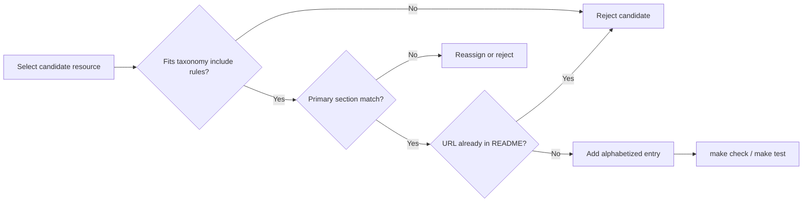

# PRD: Phase 7 Research Papers and Blog Posts Expansion

## Introduction

Expand the two underfilled **research and writing** README resource sections—**Research Papers** and **Blog Posts**—so each meets Phase 7 minimum density without weakening scope discipline. Phase 7 foundational seeding already placed entries in all ten curated sections on `main`; the core-sections batch (Theories, Coordination Patterns, Frameworks) may land first, but this batch is independent and targets only academic research and technical writing lanes.

The concrete change: add at least **8** research-paper entries (7 → ≥15) and **4** blog-post entries (6 → ≥10). Every addition must be academically relevant or a substantive technical article clearly justified by the agent-factory angle (coordination, orchestration, delegation, routing, handoffs, shared state, or group-level evaluation). Avoid launch posts, shallow trend pieces, generic AI content, and vendor marketing. Keep sections alphabetized by link text, descriptions neutral and factual, and URLs canonical and stable.

## Context

### Customer ask

Phase 7 content expansion: after the core section update lands, expand the README Research Papers and Blog Posts sections to meet the customer ask minimums while preserving quality. Increase Research Papers from 7 entries to at least 15 and Blog Posts from 6 entries to at least 10. Use academically relevant papers and technical articles only; avoid launch posts, shallow trend pieces, generic AI content, and vendor marketing. Keep sections alphabetized, descriptions neutral, and every added item clearly justified by the agent-factory angle.

### Problem

Research Papers and Blog Posts remain below Phase 7 minimum targets (15–25 papers and 10–15 blogs per [docs/internal/customer-ask.md](../../docs/internal/customer-ask.md)). Readers researching multi-agent coordination lack enough on-main academic references and practitioner writeups to compare category fit, learn from production lessons, and distinguish high-signal research from product marketing. Thin writing sections also weaken maintainer scope enforcement when borderline blog submissions arrive, because there are fewer exemplars of acceptable technical depth and tone.

### Solution

Add curated, taxonomy-aligned entries only to the two target README sections. Preserve existing seed entries unless merge conflict requires trivial hygiene. Do not modify governance prose (Scope, Contributing, Community), other curated sections, or category definitions in docs/taxonomy.md unless a factual count correction is strictly required. Verify automated README checks (`make check`, `make test`) and whitespace hygiene (`git diff --check`) pass before merge.

## Goals

- Raise **Research Papers** to at least 15 entries covering diverse research on agent groups, coordination, communication, planning, societies, evaluation, and governance.
- Raise **Blog Posts** to at least 10 entries covering architecture breakdowns, failure analyses, evaluation writeups, and engineering lessons on multi-agent orchestration.
- Keep every new entry high-signal, non-promotional, scope-aligned, and alphabetized within its section.
- Pass all repository quality gates with no regressions to governance or unrelated README sections.

## Project-level acceptance criteria

- [ ] README **Research Papers** contains at least 15 resource entries (currently 7) using `- [Resource Name](URL) - Description.` format with descriptions ending in a period and entries alphabetized by link text.
- [ ] README **Blog Posts** contains at least 10 resource entries (currently 6) using the same format, tone, and alphabetization rules.
- [ ] Every new entry is academically relevant (papers) or a substantive technical article (blogs); excludes launch posts, shallow trend pieces, generic AI content, and vendor marketing per [docs/taxonomy.md](../../docs/taxonomy.md) and [docs/rejected.md](../../docs/rejected.md).
- [ ] Every new entry includes at least one agent-factory scope keyword in the description (coordination, orchestration, delegation, routing, handoffs, shared state, or group-level evaluation) and introduces no duplicate URLs anywhere in README.md.
- [ ] README governance sections (Scope, Contributing, Community) and all non-target curated sections remain unchanged except unavoidable whitespace or merge hygiene.
- [ ] Quality gate: `make check`, `make test`, and `git diff --check` all pass from the repository root.

## User Stories

### US-001: Expand Research Papers section to minimum density

**Description:** As a researcher or architect studying multi-agent systems, I want more academically relevant papers indexed on main so I can explore coordination, communication, planning, societies, evaluation, and governance research beyond the current seven seed entries.

**Acceptance Criteria:**

- [ ] README Research Papers contains at least 15 entries below the section intro (at least 8 new entries beyond the existing seven: A Survey on Large Language Model based Autonomous Agents, AutoGen, CAMEL, Communicative Agents for Software Development, Generative Agents, Large Language Model based Multi-Agents: A Survey of Progress and Challenges, MetaGPT).
- [ ] Each new entry is peer-reviewed or widely cited research whose primary contribution is multi-agent coordination, orchestration, communication, planning, delegation, agent societies, group-level evaluation, safety, or governance per docs/taxonomy.md Research Papers include rules—not a blog post, vendor whitepaper, framework repository, or benchmark landing page.
- [ ] New entries diversify themes beyond the current survey-and-framework-paper cluster (for example coordination protocols, debate or deliberation, tool-use orchestration, human–agent teaming, safety or governance, or empirical multi-agent evaluation)—without duplicating papers whose primary home is another README section.
- [ ] Each entry uses exact format `- [Resource Name](URL) - Description.` with a factual one-sentence description ending in a period; description explicitly ties to coordination, orchestration, delegation, routing, handoffs, shared state, or group-level evaluation.
- [ ] Entries are alphabetized by link text across the full section; no duplicate URLs are introduced anywhere in README.md.
- [ ] `make check` passes after Research Papers expansion.
- [ ] Typecheck passes.
- [ ] Tests pass.

### US-002: Expand Blog Posts section to minimum density

**Description:** As a practitioner building agent factories, I want more technical articles indexed on main so I can learn from architecture breakdowns, failure analyses, and production orchestration lessons beyond the current six seed entries.

**Acceptance Criteria:**

- [ ] README Blog Posts contains at least 10 entries below the section intro (at least 4 new entries beyond the existing six: AWS LangGraph/Bedrock, Anthropic multi-agent research system, LangGraph multi-agent workflows, distributed-systems coordination essay, Agentflow orchestration lessons, multi-agent failure analysis).
- [ ] Each new entry is technical writing that teaches how groups of agents were designed, operated, or measured per docs/taxonomy.md Blog Posts include rules—not a launch announcement, shallow trend piece, generic AI overview, prompt collection, or primarily promotional vendor page.
- [ ] New URLs do not duplicate URLs already present elsewhere in README.md (including Coordination Patterns entries such as `anthropic.com/engineering/building-effective-agents` and framework or example repository roots listed under other sections).
- [ ] Each entry uses exact format `- [Resource Name](URL) - Description.` with a factual one-sentence description ending in a period and an explicit agent-factory scope keyword.
- [ ] Entries are alphabetized by link text across the full section.
- [ ] `make check` passes after Blog Posts expansion.
- [ ] Typecheck passes.
- [ ] Tests pass.

### US-003: Verify batch quality gates and section integrity

**Description:** As a maintainer merging this batch, I want end-to-end verification that expanded research and writing sections satisfy automated checks and leave unrelated repository content untouched.

**Acceptance Criteria:**

- [ ] From repository root, `make check` exits 0.
- [ ] From repository root, `make test` exits 0.
- [ ] `git diff --check` reports no whitespace errors on changed files.
- [ ] README Research Papers contains at least 15 entries and Blog Posts contains at least 10 entries; combined they include at least 12 new entries relative to pre-batch counts.
- [ ] README Scope, Contributing, and Community sections remain present and unweakened; Theories, Coordination Patterns, Frameworks, Protocols and Interfaces, Benchmarks, Case Studies, Examples and Templates, and Related Lists contain no unintended edits.
- [ ] Changed content files are limited to README.md and planning artifacts for this batch.
- [ ] Typecheck passes.
- [ ] Tests pass.

## Functional Requirements

- FR-1: Add at least 8 new Research Papers entries so the section totals at least 15 alphabetized resources.
- FR-2: Add at least 4 new Blog Posts entries so the section totals at least 10 alphabetized resources.
- FR-3: Every new entry must satisfy CONTRIBUTING.md entry format, agent-factory relevance keywords enforced by `internal/checks`, and docs/taxonomy.md category include/exclude rules.
- FR-4: Research Papers entries must use stable canonical URLs (typically arXiv abs pages, DOI landing pages, or enduring publisher links)—not blog mirrors or campaign landing pages.
- FR-5: Blog Posts entries must have verifiable technical depth (architecture detail, failure analysis, evaluation methodology, or orchestration engineering tradeoffs) maintainers can confirm from the linked content.
- FR-6: No README URL may appear more than once across all sections after this batch lands.
- FR-7: Existing seed entries in the two target sections remain unless an unavoidable merge requires trivial formatting hygiene; insert new entries in correct alphabetized sort order without removing entries to force reordering.

## Non-Goals

- Expanding Theories, Coordination Patterns, Frameworks, Protocols and Interfaces, Benchmarks, Case Studies, Examples and Templates, or Related Lists (handled by sibling Phase 7 batches).
- Rewriting docs/taxonomy.md category definitions or Phase 7 status prose unless a factual count correction is strictly required.
- Adding new top-level README sections or changing section headings.
- Broad README cleanup, URL audit, or removal of weak entries (handled by phase-7-source-quality-audit).
- Lowering scope discipline to hit count targets (quality and fit trump minimum counts).
- Meta-test planning such as inventorying registration files or asserting internal bundle structure.

## High-level technical design

This batch is a **content-only README expansion** validated by existing Phase 4 Go checks in `internal/checks`. No new packages, APIs, or UI are introduced.

**Change surface:** `README.md` sections `## Research Papers` and `## Blog Posts` only.

**Validation path:** `make check` runs structural validation (section headings, Contents alignment, entry format, description period, scope keywords, banned marketing phrases, alphabetization, duplicate URL detection). `make test` runs checker unit tests. CI mirrors these commands.

**Selection workflow for implementers:**

1. Identify taxonomy gaps not yet represented among the seven seed papers or six seed blogs (evaluation, safety, debate, human–agent teaming, routing lessons, postmortems).
2. Confirm each candidate's **primary** contribution matches the target section (research paper vs technical article vs case study).
3. Choose canonical stable URLs (arXiv abs or DOI for papers; official engineering blogs or independent technical essays for blogs).
4. Draft one-sentence neutral descriptions with an explicit scope keyword; avoid promotional wording and banned phrases (`revolutionary`, `game-changing`, `best`, `ultimate`, `cutting-edge`).
5. Insert entries in alphabetized position; run `make check` after each section edit.

## Supporting technical and UX considerations

- **Category boundaries:** A framework's GitHub repository belongs in Frameworks; its arXiv paper belongs in Research Papers—use distinct URLs. A vendor customer deployment story belongs in Case Studies; an engineering architecture essay belongs in Blog Posts.
- **Paper vs blog:** Peer-reviewed or widely cited preprints with research contributions go in Research Papers even when authors also published a summary blog—file by primary contribution.
- **Blog depth bar:** Prefer posts with concrete system detail (orchestration topology, failure modes, evaluation setup, handoff design) over product launch narratives or listicles restating common talking points.
- **URL stability:** Verify links respond before merge; prefer arXiv abs URLs and established engineering-blog permalinks over campaign or version-fragile deep links.
- **Alphabetization:** Sort by markdown link text (paper or article title), not author name or URL domain; re-read the full section after inserts.
- **Scope keywords:** `internal/checks` warns when descriptions omit agent-factory angle terms; include at least one keyword naturally in each description.

## Success Metrics

- Research Papers section reaches at least 15 entries with thematic diversity across coordination, communication, planning, societies, and evaluation.
- Blog Posts section reaches at least 10 entries with a mix of architecture, failure-analysis, and orchestration-engineering lessons.
- `make check` and `make test` pass with zero failures on the expanded README.
- No duplicate URLs and no unintended edits to non-target README sections.

## Open Questions

None. Minimum counts, quality bar, and section boundaries are defined by the customer ask and existing taxonomy.
