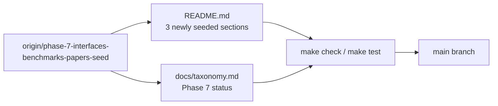

# PRD: Phase 7 Protocols, Benchmarks, and Research Papers Integration Repair

## Introduction

Converge the completed Phase 7 seed from `origin/phase-7-interfaces-benchmarks-papers-seed` onto `main`. Reapply the intended README resource entries for **Protocols and Interfaces**, **Benchmarks**, and **Research Papers** so readers and contributors see exemplar curated content for those categories on the default branch. Update `docs/taxonomy.md` so its Phase 7 status note reflects that these three sections are now seeded on `main` once this repair lands, while **Blog Posts**, **Case Studies**, and **Examples and Templates** remain deferred.

This is a narrow integration repair: land two file deltas (`README.md`, `docs/taxonomy.md`) that match the completed seed work, pass repository quality gates, and avoid unrelated documentation churn or new categories.

## Context

### Customer ask

Update README.md to add the completed seeded entries for Protocols and Interfaces, Benchmarks, and Research Papers from the finished `origin/phase-7-interfaces-benchmarks-papers-seed` work. Keep the existing Phase 7 seeded sections for Theories, Coordination Patterns, Frameworks, and Related Lists intact and untouched except for ordering or formatting strictly required to integrate the new entries coherently. Keep all new README entries factual, neutral, non-promotional, alphabetized within their sections, and compliant with the repository entry format requirements. Update docs/taxonomy.md so its Phase 7 status note reflects that Protocols and Interfaces, Benchmarks, and Research Papers are now seeded on main once this repair lands, while Blog Posts, Case Studies, and Examples and Templates remain deferred. Do not start Blog Posts, Case Studies, or Examples and Templates in this batch. Leave `make check`, `make test`, and `git diff --check` passing.

### Problem

Phase 7 content for Protocols and Interfaces, Benchmarks, and Research Papers was completed on branch `phase-7-interfaces-benchmarks-papers-seed` and marked complete by the factory, but convergence review found the intended README additions still absent from `main`. The default branch still shows empty resource sections for those three categories, and `docs/taxonomy.md` still lists them as deferred. Contributors lack on-main exemplars for protocol, benchmark, and research-paper entry format, tone, category fit, and alphabetization.

### Solution

Integrate the seed-branch README entries and taxonomy status update onto `main` as a focused repair batch. Copy the seventeen curated entries exactly as validated on the seed branch, preserve existing seeded sections (Theories, Coordination Patterns, Frameworks, Related Lists) without substantive edits, verify automated README checks pass, and confirm Scope, Contributing, and Community prose remain intact.

## Goals

- Land all seed-branch entries for Protocols and Interfaces, Benchmarks, and Research Papers on `main`
- Preserve existing Phase 7 seeded README sections (Theories, Coordination Patterns, Frameworks, Related Lists) without substantive change
- Keep new entries canonical, factual, non-promotional, period-terminated, and alphabetized by link text within each section
- Update `docs/taxonomy.md` Phase 7 status to state Protocols and Interfaces, Benchmarks, and Research Papers are seeded on `main`
- Leave deferred README sections empty (Blog Posts, Case Studies, Examples and Templates)
- Pass `make check`, `make test`, and `git diff --check` from the repository root

## Project-level acceptance criteria

- [ ] README **Protocols and Interfaces**, **Benchmarks**, and **Research Papers** each contain the intended seed-branch entries (17 total) using `- [Resource Name](URL) - Description.` format
- [ ] Every new description ends with a period, uses factual non-promotional tone, and states agent-factory relevance
- [ ] Entries within each newly seeded section are alphabetized by link text with no duplicate URLs in README.md
- [ ] README **Theories**, **Coordination Patterns**, **Frameworks**, and **Related Lists** sections remain intact except for ordering or formatting strictly required for coherent integration
- [ ] README **Scope**, **Contributing**, and **Community** sections remain present and are not weakened, shortened, or contradicted
- [ ] Deferred README sections (Blog Posts, Case Studies, Examples and Templates) receive no new entries; no new categories or unrelated doc files are introduced
- [ ] `docs/taxonomy.md` Phase 7 status prose reflects that Protocols and Interfaces, Benchmarks, and Research Papers are seeded on `main`, and Blog Posts, Case Studies, and Examples and Templates remain deferred
- [ ] Quality gate: `make check`, `make test`, and `git diff --check` all pass from the repository root

## User Stories

### US-001: Integrate Protocols and Interfaces entries onto main

**Description:** As a builder designing interoperable agent factories, I want protocol and interface standards listed on `main` so I can adopt reusable contracts for agent discovery, delegation, and message exchange.

**Acceptance Criteria:**

- [x] README **Protocols and Interfaces** contains five entries matching the seed branch: Agent2Agent Protocol, AGNTCY Agent Connect Protocol, FIPA Agent Communication Language, Model Context Protocol, and Open Agent Schema Framework
- [x] Entries appear below the section intro in alphabetical order by link text
- [x] Each entry uses exact resource name as link text and a description ending with a period
- [x] `make check` passes after Protocols and Interfaces integration
- [x] Typecheck passes
- [x] Tests pass

### US-002: Integrate Benchmarks entries onto main

**Description:** As a researcher or maintainer evaluating agent factories, I want group- and workflow-level benchmarks linked from `main` so I can compare coordination, delegation, and multi-step flow performance.

**Acceptance Criteria:**

- [x] README **Benchmarks** contains five entries matching the seed branch: AgentBench, AgentBoard, MultiAgentBench, SWE-bench, and WebArena
- [x] Entries appear below the section intro in alphabetical order by link text
- [x] Descriptions emphasize group or workflow evaluation rather than promotional product language
- [x] `make check` passes after Benchmarks integration
- [x] Typecheck passes
- [x] Tests pass

### US-003: Integrate Research Papers entries onto main

**Description:** As a reader studying multi-agent coordination research, I want foundational papers indexed on `main` so I can explore surveys, frameworks, and coordination paradigms for agent groups and flows.

**Acceptance Criteria:**

- [x] README **Research Papers** contains seven entries matching the seed branch: A Survey on Large Language Model based Autonomous Agents; AutoGen: Enabling Next-Gen LLM Applications via Multi-Agent Conversation; CAMEL: Communicative Agents for Mind Exploration of Large Language Model Society; Communicative Agents for Software Development; Generative Agents: Interactive Simulacra of Human Behavior; Large Language Model based Multi-Agents: A Survey of Progress and Challenges; and MetaGPT: Meta Programming for A Multi-Agent Collaborative Framework
- [x] Entries appear below the section intro in alphabetical order by link text
- [x] Descriptions emphasize research contribution to coordination, orchestration, or group-level behavior
- [x] `make check` passes after Research Papers integration
- [x] Typecheck passes
- [x] Tests pass

### US-004: Update taxonomy Phase 7 status for protocols, benchmarks, and papers convergence

**Description:** As a maintainer or factory operator tracking phase status, I want `docs/taxonomy.md` to reflect that Phase 7 seeding now includes Protocols and Interfaces, Benchmarks, and Research Papers on `main` so documentation matches repository state.

**Acceptance Criteria:**

- [ ] `docs/taxonomy.md` Phase 7 content-seeding prose states Protocols and Interfaces, Benchmarks, and Research Papers are seeded on `main` as part of this batch
- [ ] Taxonomy notes that Blog Posts, Case Studies, and Examples and Templates remain deferred for a later batch
- [ ] Existing taxonomy note for Theories, Coordination Patterns, Frameworks, and Related Lists seeding on `main` remains accurate
- [ ] Category definitions, include/exclude rules, and README section headings in taxonomy are unchanged
- [ ] Typecheck passes

### US-005: Verify integration repair quality gates and section integrity

**Description:** As a maintainer merging the integration repair, I want end-to-end verification that seeded content landed correctly, prior seeded sections remain intact, and repository gates pass without regressing governance sections.

**Acceptance Criteria:**

- [ ] From repository root, `make check` exits 0
- [ ] From repository root, `make test` exits 0
- [ ] `git diff --check` reports no whitespace errors on changed files
- [ ] README **Theories**, **Coordination Patterns**, **Frameworks**, and **Related Lists** sections match pre-integration content except for ordering or formatting strictly required for integration
- [ ] README **Scope**, **Contributing**, and **Community** sections remain present and unweakened with no contradictory edits
- [ ] Deferred README sections (Blog Posts, Case Studies, Examples and Templates) contain no new resource entries
- [ ] Changed files are limited to `README.md`, `docs/taxonomy.md`, and planning artifacts—no unrelated cleanup
- [ ] Typecheck passes
- [ ] Tests pass

## Functional Requirements

- FR-1: Integrate seventeen README entries from `origin/phase-7-interfaces-benchmarks-papers-seed` across three sections (Protocols and Interfaces: 5, Benchmarks: 5, Research Papers: 7)
- FR-2: Enforce CONTRIBUTING.md entry format: exact resource name link text, canonical URL, hyphen-separated description ending with a period
- FR-3: Enforce alphabetical order by link text within each newly seeded section per automated checks in `internal/checks`
- FR-4: Preserve README Theories, Coordination Patterns, Frameworks, Related Lists, Scope, Contributing, and Community sections without substantive weakening
- FR-5: Update `docs/taxonomy.md` Phase 7 status to document on-main seeding for Protocols and Interfaces, Benchmarks, and Research Papers
- FR-6: Leave three deferred README sections (Blog Posts, Case Studies, Examples and Templates) without new entries

## Non-Goals

- Seeding Blog Posts, Case Studies, or Examples and Templates
- Modifying existing entries in Theories, Coordination Patterns, Frameworks, or Related Lists beyond ordering or formatting strictly required for integration
- Adding new README categories or restructuring the Contents block
- Rewriting CONTRIBUTING.md, review-policy.md, historical.md, or factory planner docs beyond the taxonomy status note
- Changing Go checker logic, Makefile targets, or GitHub workflows
- Link-checking external URLs (optional `make links` is out of scope unless CI requires it)
- Broad refactors, unrelated formatting sweeps, or marketing tone edits to seed entries

## High-level technical design

Integration is a two-file convergence from a completed feature branch:

**Source of truth:** `git diff main origin/phase-7-interfaces-benchmarks-papers-seed` for `README.md` and `docs/taxonomy.md` defines the intended delta (+21 / −1 lines).

**Validation layer:** `go run ./internal/checks` (via `make check`) enforces section headings, Contents alignment, entry format, description terminal periods, and alphabetization. `go test ./...` (via `make test`) guards checker regressions.

**Governance guard:** Previously seeded sections (Theories, Coordination Patterns, Frameworks, Related Lists) and Scope, Contributing, and Community blocks are outside the seed diff and must remain unchanged in substance.

## Supporting technical and UX considerations

- Prefer cherry-picking or applying the seed-branch patch over reauthoring entries to avoid drift from reviewed content
- If a seed entry fails an automated check on current `main`, fix only that entry to meet the same canonical intent—do not rewrite unrelated sections
- Taxonomy status wording should reflect post-merge state: seven README sections seeded on `main`, three deferred
- No browser verification is required; observable outcomes are README rendering and automated check exit codes

## Success metrics

- All seventeen seed entries visible on `main` in the three target sections
- Zero automated README check failures after integration
- Zero whitespace errors from `git diff --check`
- Taxonomy Phase 7 status accurately describes on-main seeding state for all seven seeded sections
- No contributor-facing regression in previously seeded sections or Scope, Contributing, or Community guidance

## Open Questions

None. The seed branch diff is the authoritative integration target; scope and file boundaries are explicit.
